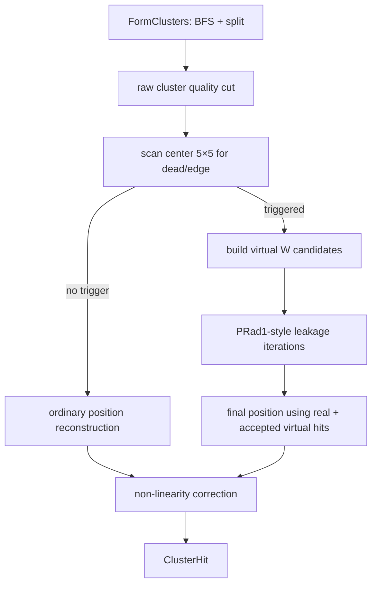

# PRad2 HyCal Shower Profile and Leakage-Correction Porting Plan

## 1. Goals and Constraints

This document proposes an implementable porting plan based on the current PRad2 `HyCalCluster`, the simplified 5×5 energy variable, and the PRad1 implementations of `PRadClusterProfile` and `LeakCorr()`.

The goals are:

1. Prefer a real tabulated shower profile while permanently retaining the current `SimpleProfile` as both an explicit option and an automatic fallback.
2. Port PRad1 virtual-module leakage correction to PRad2.
3. Provide leakage-corrected results for both Island energy and the current simplified 5×5 energy.
4. PRad2 uses W modules (PbWO4) only. Leakage logic must no longer interpret the outer ring as a W/G transition.
5. Every PRad2 W module currently marked `kTransition` must be treated as an outer calorimeter edge module.
6. Build leakage-correction candidates whenever a dead module or edge lies within the cluster center's 5×5 region.

This plan adopts the following fixed decisions:

- `SimpleProfile` is retained permanently. If a tabulated profile is not configured, cannot be opened, has an invalid format, or contains invalid data, reconstruction automatically falls back to `SimpleProfile` and prints a clear warning.
- The highest energy layer in the PRad1 PWO profile is 2.1 GeV. Every higher-energy query uses the 2.1 GeV profile directly, with no extrapolation.
- Profile mode, profile file, leakage switch, and all iteration parameters are controlled in one place: `database/reconstruction_config.json`.
- Island energy and simplified 5×5 energy use the same PRad1-style leakage-correction engine, but run it independently on their respective real-energy samples.
- No branches are added to the reconstructed ROOT tree. The existing `cl_energy` stores the final energy after leakage, non-linearity, and all other energy corrections.

The recommended unified definition of an “edge” is:

```text
outer W edge: kTransition
inner beam-hole edge: kInnerBound
compatibility edge: kOuterBound (retained mainly for the PRad1/G-module path)
```

All real and virtual calorimeter cells in PRad2 correction must use the `PbWO4` profile.

## 2. Review Scope and Code Version

Current project: `/home/liyuan/evviewer/main/prad2evviewer`

- Commit at review time: `1bab02abe247d7410c60053e697b2f9fa8abde91`
- PRad1 reference analysis: `docs/technical_notes/prad1_shower_profile.md`
- PRad1 reference source: `/home/liyuan/OL_monitor/PRadAnalyzer`

Key PRad2 files:

- `prad2det/include/HyCalCluster.h`
- `prad2det/src/HyCalCluster.cpp`
- `prad2det/include/HyCalSystem.h`
- `prad2det/src/HyCalSystem.cpp`
- `prad2det/include/HyCalDeadModules.h`
- `prad2det/include/PipelineBuilder.h`
- `prad2det/src/PipelineBuilder.cpp`
- `database/hycal_map.json`
- `database/reconstruction_config.json`
- `database/cluster_profiles/prof_pwo.dat`
- `prad2det/include/EventData.h`
- `prad2det/include/EventData_io.h`
- `python/bind_det.cpp`

## 3. Current Island Algorithm in `HyCalCluster`

### 3.1 Inputs and Thresholds

Each pulse is added to `hits_` through:

```cpp
HyCalCluster::AddHit(module_index, energy, time)
```

Only hits satisfying:

```text
energy > min_module_energy
```

are stored. The current production configuration is:

| Parameter | Current value |
|---|---:|
| `min_module_energy` | 1.0 MeV |
| `min_center_energy` | 10.0 MeV |
| `min_cluster_energy` | 50.0 MeV |
| `corner_conn` | false |
| `split_iter` | 6 |
| `least_split` | 0.01 |
| `log_weight_thres` | 3.6 |
| `seed_time_window` | 4.0 ns |

### 3.2 Seed-Driven BFS Island Formation

`group_hits()` is not the original simple DFS from PRad1. It is a seed-driven BFS that supports multiple pulses per module:

1. Sort pulses by descending energy.
2. The largest unconsumed pulse satisfying `min_center_energy` becomes a seed.
3. `grow_island()` expands from the seed through adjacent modules.
4. At most one unconsumed pulse is selected from each adjacent module: the highest-energy pulse within the seed's `±seed_time_window`.
5. A selected pulse is marked consumed. Other pulses on the same module may still form another cluster at a different time.
6. With `corner_conn=false`, BFS does not expand through diagonal adjacency.

PRad2 Island's spatial connectivity is therefore tied to seed time. Leakage correction must preserve the cluster's seed time and must not reabsorb pulses outside the time window.

### 3.3 Local Maxima and the Split Decision

`find_maxima()` searches each island for local maxima:

- Candidate energy must be at least `min_center_energy`.
- Local-maximum comparisons always include diagonal neighbors, independently of `corner_conn`.
- Other pulses on the same module that did not enter the current island do not participate in the comparison.

Profile splitting is skipped, and the whole group is assigned to the first maximum, when:

```text
maxima.size() == 1
group.size() >= 100
maxima.size() >= 10
```

### 3.4 Current Profile-Based Multi-Peak Splitting

The current code retains the PRad1 Island-splitting structure, but its default profile is `SimpleProfile`:

```cpp
if (dist < 0.01) return 0.78;
return 0.78 * exp(-dist*dist/(2*sigma*sigma));
```

It has three limitations:

- It is independent of shower energy.
- It is not the tabulated PRadSim/GEANT4 profile.
- It provides only `frac`, not the `err` required by the PRad1 leakage estimator.

The initial multi-peak splitting weight is:

\[
F_{ji}^{(0)} =
p\!\left(d(center_i,hit_j),E_{center,i}/0.78\right)E_{center,i}.
\]

On each iteration:

1. Normalize the weights of all maxima for each hit.
2. Reconstruct each shower position using only the 3×3 hits around its maximum.
3. Use the allocated energy for every participating hit:

   \[
   E_{ji}=E_j\frac{F_{ji}}{\sum_kF_{jk}}.
   \]

4. Reconstruct a continuous position with logarithmic weighting:

   \[
   w_j=\max\left(0,3.6+\ln(E_{ji}/E_{tot})\right).
   \]

5. Recalculate profile weights for every hit in the group using the new position and `tot_E`.

The default is six iterations. Final shares below 1% are removed, retained shares are written into multiple `ModuleCluster` objects, and `kSplit` is set.

### 3.5 Current Position and Island Energy

`reconstruct_pos()` behaves as follows:

- Position uses only cluster hits in the seed's 3×3 neighborhood.
- Cluster total energy is `ModuleCluster::energy`.
- Position is reconstructed before the per-center-module non-linearity correction is calculated.
- The current output `ClusterHit::energy` is:

  \[
  E_{island,out}=E_{cluster}\times linear\_corr.
  \]

There is currently no leakage correction. Although `kLeakCorr` is defined, no code sets it.

## 4. Exact Semantics of the Current Simplified 5×5 Energy

`ClusterHit::energy_square` is calculated inside `reconstruct_pos()`:

```cpp
for (const auto &hit : hits_) {
    if (timing cut fails) continue;
    qdist(center_mod, hit_mod, dx, dy);
    if (abs(dx) < 2.51 && abs(dy) < 2.51)
        energy_square += hit.energy;
}
```

It is not a second clustering algorithm. It is an independent simplified energy estimator centered on the Island cluster center:

- Its center is the Island cluster seed.
- It sums event-level raw `hits_`, not `ModuleCluster::hits`.
- It uses quantized coordinates `|dx|<2.51 && |dy|<2.51`, which is a 5×5 region on the regular W grid.
- When timing gating is enabled, only pulses within the seed time `±seed_time_window` are accumulated.
- It does not use Island split fractions, so the 5×5 regions of two nearby clusters can count the same raw hit twice.
- If one module has multiple pulses inside the time window, the current implementation adds all of them.
- It does not apply `linear_corr`.
- It does not distinguish dead modules from edges and has no leakage correction.

`energy_square` is currently used mainly by `analysis/tools/physics_calib.cpp` for 5×5 calibration. Porting must not directly change its legacy semantics without a version marker, because doing so would change existing calibration histograms.

Here “legacy semantics” means that the 5×5 sample-selection rule remains unchanged. When leakage correction is enabled, `energy_square` itself stores the result of applying the same leakage correction to that sample. When the switch is disabled, or when no dead/edge trigger is present, it remains equal to the current raw 5×5 sum.

## 5. Reusable Core of PRad1 Leakage Correction

For a PRad1 cluster that has passed the cluster-quality threshold:

1. Find the virtual neighbors associated with the center module.
2. Reconstruct the initial position from real cluster hits.
3. Query the shower profile for each virtual module:

   \[
   f_v=p_t(d(recon,v),E).
   \]

4. When `least_leak < f_v < 1`, estimate virtual energy:

   \[
   E_v=E_{current}f_v.
   \]

5. Recalculate the position and candidate total energy from real and virtual hits.
6. Evaluate whether the candidate improves agreement using profile `frac`, `err`, and calorimeter energy resolution:

   \[
   est=\frac{1}{N}\sum_j
   \frac{|E_j-E_cf_j|}
   {\sqrt{E_c^2\sigma_{f,j}^2+\sigma_E(E_c)^2f_j^2}}.
   \]

7. Accept the new state only if the estimator decreases; otherwise restore the previous iteration and stop.
8. Add final virtual energies to cluster energy and set `kLeakCorr`.

PRad2 should reuse this fixed-point-plus-estimator structure, but it must not copy PRad1's G-module virtual geometry.

## 6. PRad2 Geometry Semantics Must Be Corrected First

### 6.1 Mismatch Between the Current Map and the Target Physical Semantics

At review time, `database/hycal_map.json` still contains:

| Type | Entries |
|---|---:|
| `PbWO4` | 1152 |
| `PbGlass` | 576 |
| `LMS` | 3 |
| `Veto` | 4 |

The constraint for this task is that PRad2 no longer uses any G modules. Because the project still supports replay through `database/prad1/`, `PbGlass` cannot simply be removed from the shared enumeration. An explicit active-detector policy is recommended:

```json
"hycal": {
  "active_module_types": ["PbWO4"]
}
```

Recommended behavior:

- PRad2 pipeline: allow only `PbWO4` into `HyCalCluster` and fix the profile type to `PbWO4`.
- PRad1 pipeline: allow `PbWO4 + PbGlass` by configuration to preserve legacy replay.
- Initialization logs print active W/G counts. If the active G count is nonzero in PRad2, issue at least a warning; production mode should preferably fail.

This constraint cannot rely only on callers writing `if (!mod->is_pwo4()) continue`. Several current call sites use `is_hycal()`, which accepts both W and G and can accidentally feed G hits into PRad2 clustering.

### 6.2 `kTransition` Means Edge in PRad2

`HyCalSystem::assign_layout()` currently marks the outermost ring of the W array as `kTransition`:

```text
row == 0 || row == 33 || column == 0 || column == 33
```

In PRad1 semantics, transition denotes the W/G boundary. In W-only PRad2, this ring is the outer boundary of the active calorimeter. Comments and helper functions must be updated so later code does not continue interpreting it as a material transition:

```cpp
bool Module::is_leakage_edge(bool prad2_w_only) const;
```

For PRad2, the recommended result is:

```text
kTransition || kInnerBound
```

while continuing to recognize `kOuterBound` for compatibility. Do not inspect only the cluster center's own flag; this task requires scanning the center's 5×5 region.

### 6.3 Physical Gaps in the W Array

The W geometry is a 34×34 lattice, but the central beam hole lacks four real modules:

```text
W561, W562, W595, W596
```

These positions must participate in leakage correction as inner-edge virtual W cells. They are not event hits and must not be appended to the real `modules_` array or the DAQ lookup.

## 7. Recommended Virtual W-Module Design

### 7.1 Do Not Mix Virtual Modules into the Real Module Array

Virtual W modules should not be appended directly to `HyCalSystem::modules_`, because that would contaminate:

- `module_count()` and every event array sized by module count;
- DAQ, calibration, and name/ID lookup;
- the real-module list exposed to Python;
- neighbor-table construction and monitoring pages.

Add a separate geometry-only type instead:

```cpp
enum class VirtualCellReason : uint8_t {
    Dead,
    OuterEdge,
    InnerHole
};

struct VirtualWModule {
    int row;
    int column;
    float x;
    float y;
    float size_x;
    float size_y;
    int backing_module_index; // valid for a dead real cell; otherwise -1
    VirtualCellReason reason;
};

struct VirtualHit {
    VirtualWModule cell;
    float energy = 0.f;
};
```

These objects always query the profile as `ModuleType::PbWO4`.

### 7.2 Expose Read-Only W-Grid Geometry Queries

`SectorGrid` is currently private to `HyCalSystem`. Provide a read-only API:

```cpp
const Module *w_module_at(int row, int col) const;
bool is_w_grid_coordinate(int row, int col) const;
VirtualWModule make_virtual_w_cell(int row, int col,
                                   VirtualCellReason reason) const;
```

Virtual-cell coordinates are extrapolated directly from W-lattice pitch and known row/column indices. They must not call PRad1's `get_sector_id()` and then fall into a PbGlass sector.

### 7.3 5×5 Trigger Test

For every formed cluster center `(r_c,c_c)`, scan:

```text
dr = -2..+2
dc = -2..+2
```

The recommended diagnostic result is:

```cpp
struct LeakageNeighborhood {
    bool has_dead = false;
    bool has_outer_edge = false;
    bool has_inner_edge = false;
    std::vector<VirtualWModule> candidates;
};
```

The trigger condition is defined strictly as:

```text
needs_leakage = has_dead || has_outer_edge || has_inner_edge
```

Specifically:

- If a real module within the 5×5 has `kDeadModule`, set `has_dead=true`.
- If a real W module within the 3×3 has `kTransition`, set `has_outer_edge=true`; this means the 5×5 already extends beyond the module edge.
- If a real W module within the 3×3 has `kInnerBound`, or the scan reaches a beam-hole gap, set `has_inner_edge=true`.
- `kDeadNeighbor` can only be a fast hint, not the final criterion. It currently marks only one ring of direct neighbors and does not satisfy the 5×5 requirement.

### 7.4 Building Virtual Candidates from the Trigger Region

The trigger test and candidate extent must be treated separately:

- Dead module: add every dead W module inside the 5×5 as a virtual candidate.
- Outer edge: for each `kTransition` W module encountered in the 3×3, add the directly adjacent virtual lattice cells in its 5×5 region that cross the active W boundary.
- Inner edge: add beam-hole gaps adjacent to inner-bound modules within the 5×5.
- Deduplicate candidates by `(row,column)`.

This preserves the PRad1 physical meaning of adding only one layer of boundary virtual neighbors while satisfying the rule that correction starts whenever the center's 5×5 sees a dead module or edge. For example, when the center is two cells from the outer ring, its 5×5 sees the edge module. A virtual cell one layer outside that edge can be about three module widths from the center, which is still inside the PRad1 profile's `max_dist=5`.

## 8. Porting the Tabulated W Shower Profile

### 8.1 Interface Upgrade

The current `IClusterProfile` returns only `float frac`. Change it to:

```cpp
struct ProfileValue {
    float frac = 0.f;
    float err  = 0.f;
};

class IClusterProfile {
public:
    virtual ~IClusterProfile() = default;
    virtual ProfileValue Get(ModuleType type,
                             float dist,
                             float energy) const = 0;
    virtual bool valid(ModuleType type) const = 0;
};
```

A temporary `GetFraction()` wrapper can be retained to reduce the size of the initial Island-splitter change.

Add `TabulatedClusterProfile` with PRad1-compatible behavior:

- Read `min_ene max_ene step_ene max_dist step_dist` from the file header.
- Read `ie id frac err` from table entries.
- Use the nearest distance grid point.
- Linearly interpolate between adjacent energy layers.
- Clamp energy outside the range to the first or last layer.
- Return `(0,0)` for `dist >= max_dist`.
- During loading, verify that all `Ne × Nd` entries exist and are finite.

### 8.2 Load Only the W Profile in PRad2

Recommended configuration:

```json
"hycal": {
  "profile_mode": "tabulated",
  "cluster_profile_file": "cluster_profiles/prof_pwo.dat"
}
```

Supported `profile_mode` values:

```text
tabulated  Prefer the file; automatically fall back to SimpleProfile on any loading failure
simple     Explicitly use SimpleProfile without reading a file
```

`SimpleProfile` is a permanent fallback, not temporary test code. The fallback must be visible: startup logs print the requested mode, effective mode, file path, and reason for failure, and event reconstruction continues.

PRad2 does not need to load `prof_lg.dat`. The W profile is mandatory for all of the following:

- Initial Island splitting.
- Iterative Island splitting.
- Virtual hits for dead W modules.
- Virtual W modules at the outer edge.
- Virtual W modules at the beam hole.

The current `get_profile_frac_at()` calls `get_sector_id()` based on the reconstructed position and may select a PbGlass sector near or beyond the W outer boundary. W-only PRad2 must disable this material switch and use W-grid quantized distance:

\[
d=\sqrt{((x_v-x_c)/s_x^W)^2+((y_v-y_c)/s_y^W)^2}.
\]

### 8.3 Profile Lifetime

`HyCalCluster` currently constructs `new SimpleProfile()`. The `SetProfile()` comment says it takes ownership, while the implementation actually sets `owns_profile_=false`; the interface semantics are inconsistent.

Change the member to:

```cpp
std::shared_ptr<const IClusterProfile> profile_;
```

`PipelineBuilder` attempts to load the profile once at startup, stores it in `Pipeline`, and lets all per-event `HyCalCluster` instances share the immutable object. `AppState` must not reread a 4.7 MB profile file every time it creates a per-event clusterer. If loading fails, `PipelineBuilder` creates and shares a `SimpleProfile` instead of terminating the pipeline.

### 8.4 PRad1 Profile Energy Limit

The PRad1 `prof_pwo.dat` energy range is 200–2100 MeV, while PRad2 production data may reach about 3.5 GeV. This plan explicitly uses endpoint clamping:

```text
energy < 200 MeV   → use the 200 MeV profile
200–2100 MeV       → linearly interpolate adjacent energy layers using PRad1 rules
energy > 2100 MeV  → always use the 2100 MeV profile
```

No functional extrapolation is performed above 2.1 GeV, and exceeding the table range does not cause a fallback to `SimpleProfile`. Fallback occurs only when the complete tabulated profile is unavailable. Startup logs print the profile range. A query/clamp counter may be retained for diagnostics, but clamping is normal, supported production behavior.

### 8.5 Copied Profile File

The PRad1 PWO profile has been copied to:

```text
database/cluster_profiles/prof_pwo.dat
```

Source:

```text
/home/liyuan/OL_monitor/PRadAnalyzer/database/cluster_profiles/prof_pwo.dat
```

At review time, both files contain 100024 lines and have SHA-256:

```text
66f3dcda082a33880de9f11becb23b22e5776843fb1688e567d2497d25bfb38e
```

## 9. Island Leakage-Correction Design

### 9.1 Data Model

Keep measured and leakage components internally so the algorithm can iterate, roll back, and be tested:

```cpp
struct ModuleCluster {
    ...
    float energy = 0.f;             // measured/split Island sum
    float leakage = 0.f;            // accepted virtual energy
    std::vector<VirtualHit> virtual_hits;
};
```

These components do not need to be written to the reconstructed ROOT tree. Keep the existing `ClusterHit` output interface compatible:

```cpp
struct ClusterHit {
    ...
    float energy;        // final energy after leakage, non-linearity, and all other corrections
    float energy_square; // 5×5 energy corrected by the same leakage engine
};
```

The energy convention is:

```text
ModuleCluster::energy = measured energy
ClusterHit::energy = (ModuleCluster::energy + leakage) × linear_corr
```

Raw/leakage components can be checked through debug diagnostics, test return values, or logging, but no production ROOT branches are added.

### 9.2 Execution Order

Recommended pipeline:



Apply `min_cluster_energy/min_cluster_size` to the raw cluster before leakage correction. This preserves PRad1 behavior: leakage cannot promote a previously invalid cluster across the quality threshold.

Leakage correction runs before non-linearity correction. The non-linearity input becomes:

\[
E_{preNL}=E_{raw}+E_{leak}.
\]

### 9.3 Iterative Algorithm

Add:

```cpp
LeakageResult correct_leakage(const ModuleCluster &cl,
                              const LeakageNeighborhood &nb) const;
double eval_cluster_profile(const RecoPoint &center,
                            const ModuleCluster &cl) const;
```

Initial state:

```text
position = position reconstructed from real cluster hits
Ecurrent = cl.energy
virtual energies = 0
est = EvalCluster(position, Ecurrent, real hits)
```

On each iteration:

1. Query `ProfileValue` for every virtual W cell.
2. Keep only candidates satisfying `least_leakage_fraction < frac < 1`.
3. Set:

   \[
   E_v=E_{current}f_v.
   \]

4. Reconstruct position from the central 3×3 of real and virtual hits.
5. Set `Enew = cl.energy + sum(Ev)`.
6. Calculate `new_est`; accept only when `new_est < est`.
7. Otherwise roll back the current iteration and stop.

Initially align the default parameters with PRad1:

```json
"leakage_correction": true,
"leakage_iterations": 6,
"least_leakage_fraction": 0.01,
"leakage_trigger_half_width": 2
```

### 9.4 Energy Resolution

The PRad1 estimator needs `sigma_E(E)`. `HyCalSystem` currently has position resolution but no energy resolution. Add W-only energy-resolution configuration, for example:

```json
"energy_resolution": [3.3, 0.0, 0.0]
```

Define the percentage parameters as:

\[
\frac{\sigma_E}{E}=\frac{1}{100}
\sqrt{\frac{a^2}{E_{GeV}}+b^2+\frac{c^2}{E_{GeV}^2}}.
\]

The production values must eventually be confirmed with PRad2 W-module beam or MC data. Do not reuse position resolution or the temporary smear constant in `sim2replay_hc.cpp` as production energy resolution. For now, use the values shown above: `3.3, 0.0, 0.0`.

### 9.5 Cluster Flags

Recommended behavior:

- Set `kLeakCorr` when correction is actually accepted and `leakage>0`.
- Do not set `kLeakCorr` when a trigger has no valid candidate or every iteration is rejected.
- Preserve the center module's layout bits in the cluster flag.

Do not use `kTransition` itself to mean “already corrected”; it only identifies a geometric edge.

## 10. Leakage-Correction Design for Simplified 5×5 Energy

### 10.1 Share One Correction Engine with Island

`energy_square` must execute the same PRad1-style leakage correction as Island energy, including:

- The same center-5×5 dead/edge trigger.
- The same virtual-W candidate builder.
- The same tabulated or Simple profile instance.
- The same `least_leakage_fraction`, iteration count, estimator, rollback, and correction-fraction guard.
- The same fallback to `SimpleProfile` when the profile file is unavailable.
- The same fixed use of the 2.1 GeV profile for `E>2.1 GeV`.

Factor the algorithm into a common function that accepts different real-energy samples:

```cpp
LeakageResult correct_energy_sample(const EnergySample &sample,
                                    const LeakageNeighborhood &nb) const;
```

Island and 5×5 each construct their own `EnergySample` and call the same function. Do not maintain two leakage implementations that can diverge over time.

### 10.2 Explicitly Build the Real 5×5 Sample

Extract the current inline loop into:

```cpp
SquareEnergySample build_square_sample(const ModuleCluster &cl) const;
```

It records:

- Original pulse energies within the seed time window and center 5×5.
- Aggregated energy for each module.
- Raw `energy_square`.
- Dead/edge trigger information.
- The same virtual-candidate list used by Island leakage.

Aggregate multiple in-time pulses on the same module into one cell energy before passing them to the profile estimator. This preserves the current energy sum while preventing the estimator from treating one physical cell as multiple spatial observations.

### 10.3 Executing 5×5 Correction

Do not add the leakage value calculated for Island directly to `energy_square`. For multiple showers, split Island energy and the unsplit 5×5 sample are different estimators. They must call the same correction engine but solve independently.

The initial 5×5 input is:

1. Real hits: in-time cell energies aggregated by module within the 5×5.
2. Initial energy: the current raw `energy_square`.
3. Initial position: reconstructed from the sample's central 3×3 using the current logarithmic weighting.
4. Virtual candidates: the same center-5×5 scan result used by Island.

Then run the complete iteration described in Section 9.3. On every iteration, calculate for virtual candidates:

\[
E_v=E_{current}p_W(d(x,y,v),E_{current}),
\]

and update:

\[
E_{new}=E_{square,raw}+\sum_vE_v.
\]

Real cells in the 5×5 enter the same profile estimator used by Island. Accept only when `new_est` decreases; otherwise roll back. The final behavior is:

```text
leakage_correction=false or no trigger → energy_square = raw 5×5 sum
correction accepted                    → energy_square = raw 5×5 sum + accepted leakage
all correction attempts rejected       → energy_square = raw 5×5 sum
```

Add guards:

```json
"max_leakage_fraction": 0.30,
"leakage_convergence_rel": 0.001
```

If an event exceeds the limit, do not apply correction and set a diagnostic flag. This prevents a bad profile file, duplicate candidates, or a geometry error from causing energy divergence.

## 11. Configuration and Pipeline Wiring

Add the following to `database/reconstruction_config.json`:

```json
"hycal": {
  "active_module_types": ["PbWO4"],
  "profile_mode": "tabulated",
  "cluster_profile_file": "cluster_profiles/prof_pwo.dat",
  "leakage_correction": true,
  "leakage_iterations": 6,
  "least_leakage_fraction": 0.01,
  "leakage_trigger_half_width": 2,
  "leakage_convergence_rel": 0.001,
  "max_leakage_fraction": 0.30,
  "energy_resolution": [3.3, 0.0, 0.0]
}
```

Meaning:

- `profile_mode="tabulated"`: try the specified file and automatically use `SimpleProfile` on failure.
- `profile_mode="simple"`: explicitly force `SimpleProfile`.
- `cluster_profile_file`: resolve relative to the database root.
- `leakage_correction`: controls leakage for both Island and 5×5; they cannot be enabled independently.
- Both energy estimators share all other leakage parameters.

`PipelineBuilder` must:

1. Parse these knobs into `ClusterConfig`.
2. Build the virtual-W geometry helper after the detector map and dead-module flags are ready.
3. Resolve the relative profile path and attempt to load it once.
4. Automatically construct a `SimpleProfile` fallback if the file is not configured, cannot be opened, or fails validation; continue building the pipeline.
5. Put the effective immutable profile in `Pipeline` for all clusterers to share.
6. Log the requested and effective profile modes, file, fallback reason, energy/distance ranges, active W/G counts, dead-cell count, and correction switch.

To preserve PRad1 replay, `database/prad1/prad_reconstruction_config.json` can explicitly disable the new correction or configure PRad1 W/G profiles and legacy virtual geometry. PRad2 W-only assumptions must not implicitly alter the PRad1 path.

## 12. Output Data and Compatibility

### 12.1 C++ / Python API

The Python binding should expose:

- New leakage-configuration fields.
- Virtual-candidate count and leakage reason, at least through a debug/diagnostic interface.
- `TabulatedClusterProfile::Load()` status and ranges.

### 12.2 Reconstructed ROOT Tree

Add **no new branches** to the reconstructed ROOT tree. Continue writing the existing fields:

```text
cl_energy
cl_linear_corr
cl_flag
```

Keep:

```text
cl_energy = (Island measured energy + accepted leakage) * cl_linear_corr
```

Thus, `cl_energy` always stores the final energy after leakage, non-linearity, and any other energy corrections in the reconstruction chain. Continue writing `cl_linear_corr` and `cl_flag` with the existing schema; set `kLeakCorr` in `cl_flag` when leakage is accepted.

`energy_square` is not currently a reconstructed ROOT branch. It remains available only through `ClusterHit` and calibration tools. When leakage is enabled, it directly stores the 5×5 energy after the same leakage correction. Do not add a ROOT branch for it.

## 13. Implementation Phases

### Phase A: Geometry and Test Foundation

1. Add an active-module policy and fix PRad2 to W-only.
2. Correct the `kTransition` comment and `is_leakage_edge()` semantics.
3. Add W-grid lookup and a geometry-only `VirtualWModule`.
4. Implement center-5×5 dead/edge scanning and candidate deduplication.
5. Add unit tests for the outer ring, corners, beam hole, and dead modules.

Completion criterion: for any W center, the code can reliably report whether correction is triggered, why it is triggered, and the exact virtual-cell coordinates, without changing the real `module_count()`.

### Phase B: Profile Loader

1. Add `ProfileValue{frac,err}`.
2. Implement and test `TabulatedClusterProfile`.
3. Load once in `PipelineBuilder` and share the result.
4. Force the W profile in PRad2 and fix profile type and distance near edges in `get_profile_frac_at()`.
5. Permanently retain `SimpleProfile` as both an explicit choice and a production fallback when tabulated-profile loading fails.

Completion criterion: PRad2 Island splitting matches a PRad1 W-profile reference calculation entry by entry. Profile failure produces a clear warning, automatically selects `SimpleProfile`, and does not stop reconstruction.

### Phase C: Island Leakage Correction

1. Add the leakage-result data structure.
2. Implement PRad1-compatible virtual-energy iteration and the estimator.
3. Insert correction after the raw quality cut and before non-linearity.
4. Make `ClusterHit::energy` return the fully corrected final energy with the correct flags; retain raw/leakage components only for internal diagnostics.
5. Add a correction-fraction limit, NaN/division-by-zero guards, and iteration diagnostics.

Completion criterion: a central cluster with no dead module or edge has bitwise/numerically unchanged output; a triggered cluster has finite, non-negative, reversible correction.

### Phase D: 5×5 Correction

1. Extract `SquareEnergySample`.
2. Make Island and 5×5 call the same `correct_energy_sample()`.
3. Preserve the old `energy_square` when correction is disabled or not triggered; write corrected 5×5 energy directly into `energy_square` when correction is accepted.
4. Update calibration tools and documentation so they clearly record the leakage-switch state from reconstruction configuration.

Completion criterion: with correction disabled, existing calibration histograms are unchanged. With correction enabled, `energy_square` changes only for triggered clusters. No ROOT branch is added.

### Phase E: Data Validation and Enablement

1. Run a PRad1 W-only synthetic regression.
2. Check closure against PRad2 GEANT4 truth.
3. Validate clean elastic/Møller data in bins of edge/dead distance.
4. Verify that every query above 2.1 GeV consistently uses the 2.1 GeV profile and quantify closure with endpoint clamping.
5. Set the production default of `leakage_correction` to true only after validation.

## 14. Test Matrix

### 14.1 Profile-Loader Unit Tests

- Correctly read the `20×5001` table.
- Test `dist=0`, the nearest distance grid point, and `dist>=5`.
- Test energy below the range, at grid points, between grid points, at the upper bound, and clamped beyond it.
- Verify that `E=2100 MeV` and every `E>2100 MeV` return exactly the same final-layer profile and that high-energy clamping does not invoke the `SimpleProfile` fallback.
- Test missing rows, duplicate indices, out-of-range indices, NaN, and empty files.
- Match PRad1 reference interpolation for both `frac` and `err`.
- For a missing, corrupted, or incomplete file, log a warning and automatically select `SimpleProfile`. With `profile_mode=simple`, do not attempt to read a file.

### 14.2 Geometry/Trigger Unit Tests

| Center case | Expected 5×5 state | Correction |
|---|---|---|
| Interior, no nearby dead module | No dead/edge | Not triggered |
| Center two cells from outer ring | 5×5 contains `kTransition` | Trigger outer-edge correction |
| Center on outer ring | Contains edge | Trigger outer-edge correction |
| Center at outer corner | Contains edges in two directions | Trigger and deduplicate virtual cells |
| Near beam hole | Contains `kInnerBound`/gap | Trigger inner-edge correction |
| Dead module in 5×5 but not directly adjacent | `kDeadNeighbor` may be false | Must still trigger |
| Dead module outside 5×5 | Does not contain dead module | Not triggered |

### 14.3 Algorithm Regression

- With `leakage_correction=false`, Island energy, position, and flags match the current commit.
- With the switch enabled but no correction trigger, output matches the current result.
- Virtual energy for one dead cell matches a hand-calculated profile result.
- Roll back when the estimator worsens.
- `count==0`, `sigma2<=0`, or an invalid profile does not produce NaN.
- Every daughter of a split cluster is evaluated independently using its own center 5×5.
- In multi-pulse mode, virtual correction does not absorb pulses outside the seed time window.
- Correction does not promote a raw invalid cluster across the cluster-quality threshold.
- For the same synthetic sample, the Island and 5×5 paths call the same correction engine and obey the same accept/rollback rules.

### 14.4 Physics Validation Plots

At minimum, plot:

1. `Eraw/Eexpected` and `Ecorr/Eexpected` versus center distance to the outer edge.
2. The same quantities versus grid distance to the nearest dead module.
3. Separate comparisons for beam-hole edge, outer edge, and dead module.
4. Correction fraction `Eleak/Eraw` versus energy, position, and virtual-cell count.
5. Closure and resolution of corrected Island and 5×5 estimators.
6. A non-edge/dead control sample to verify that its mean and resolution do not change.
7. Profile-query energy-clamp rate, especially for `E>2.1 GeV`.

## 15. Implementation Patterns to Avoid

- Do not remove or disable `SimpleProfile`; it must always be explicitly selectable and available as a production fallback.
- Do not switch automatically to the PbGlass profile by sector at a PRad2 edge.
- Do not inspect only the center's own `kTransition/kDeadNeighbor`; the requirement covers the entire center 5×5.
- Do not append virtual cells to the real `modules_` array.
- Do not add Island leakage directly to 5×5 energy; the two real-energy samples differ.
- Do not change `energy_square` when correction is disabled or not triggered. When the switch is enabled and correction is accepted, it stores corrected 5×5 energy as specified.
- Do not fall back without logging. If profile loading fails, warn and clearly report that `SimpleProfile` is effective.
- Do not apply the raw cluster-acceptance cut after leakage.
- Do not let PRad2 W-only changes break replay through `database/prad1/`; the active-detector policy must be explicit.

## 16. Recommended Minimal First PR

The first implementation PR should contain only:

1. `TabulatedClusterProfile` and complete loader tests.
2. Upgrade `IClusterProfile` to `frac+err` and migrate Island splitting to the new interface.
3. PRad2 W-only profile type and quantized-distance fixes.
4. W-grid 5×5 leakage-trigger/candidate builder and geometry tests.
5. Configuration parsing, shared profile lifetime, and startup logging.

This PR does not yet change reconstructed energy. A second PR then adds Island leakage so the existing `cl_energy` contains final corrected energy. A third PR makes the 5×5 estimator call the same correction engine and writes the result back to the existing `energy_square`. No reconstructed ROOT branches are added at any stage. This separation makes it possible to validate profile/geometry correctness, Island correction, and 5×5 correction independently and to localize discrepancies.

## 17. Key Source Locations

| Topic | Current file and lines |
|---|---|
| Cluster configuration / data types / simple profile | `prad2det/include/HyCalCluster.h:28-158` |
| BFS grouping | `prad2det/src/HyCalCluster.cpp:136-207` |
| Maxima / split decision | `prad2det/src/HyCalCluster.cpp:213-269` |
| Profile split | `prad2det/src/HyCalCluster.cpp:275-390` |
| Position / Island energy | `prad2det/src/HyCalCluster.cpp:396-480` |
| Current raw 5×5 energy | `prad2det/src/HyCalCluster.cpp:442-454` |
| Current profile adapters | `prad2det/src/HyCalCluster.cpp:494-515` |
| Layout flags | `prad2det/include/HyCalSystem.h:29-44` |
| W transition / edge assignment | `prad2det/src/HyCalSystem.cpp:251-268` |
| Dead-module flags | `prad2det/include/HyCalDeadModules.h:24-69` |
| Cluster-configuration parsing | `prad2det/src/PipelineBuilder.cpp:96-108` |
| Detector and dead-module setup | `prad2det/src/PipelineBuilder.cpp:276-300` |
| Current production configuration | `database/reconstruction_config.json:hycal` |
| Reconstructed output arrays | `prad2det/include/EventData.h:194-212` |
| ROOT branch wiring | `prad2det/include/EventData_io.h:283-300` |
| Python bindings | `python/bind_det.cpp:694-734` |
