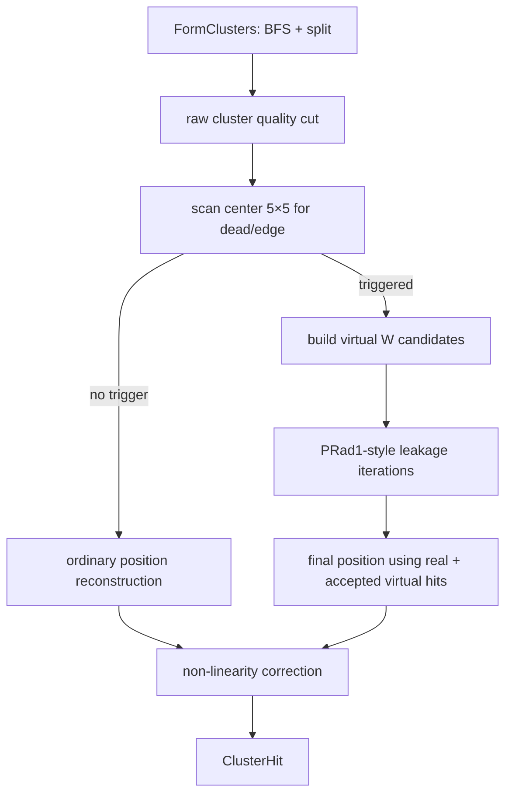

# PRad2 HyCal shower profile 与 leakage correction 移植计划

## 1. 目标与约束

本文基于当前 PRad2 `HyCalCluster`、简化的 5×5 energy 变量，以及 PRad1 `PRadClusterProfile` / `LeakCorr()` 的实现，给出一套可落地的移植方案。

目标是：

1. 优先使用真实的 tabulated shower profile，同时永久保留当前 `SimpleProfile` 作为显式选择和自动 fallback。
2. 将 PRad1 的 virtual-module leakage correction 移植到 PRad2。
3. 同时为 Island energy 和当前简化的 5×5 energy 提供漏能修正结果。
4. PRad2 中只使用 W module（PbWO4）；不允许 leakage 逻辑再把外圈解释成 W/G transition。
5. 当前标有 `kTransition` 的 PRad2 W modules 一律视为 calorimeter 的外部 edge modules。
6. 只要 cluster center 的 5×5 范围内存在 dead module 或 edge，就触发 leakage correction 候选构建。

本计划采用以下固定决策：

- `SimpleProfile` 永远保留；tabulated profile 未配置、打不开、格式错误或内容无效时自动 fallback，并打印明确警告。
- PRad1 PWO profile 的最大能量层为 2.1 GeV；所有更高能量查询直接使用 2.1 GeV profile，不做外推。
- profile 模式、profile 文件、leakage 开关和全部迭代参数统一由 `database/reconstruction_config.json` 控制。
- Island energy 与简化 5×5 energy 使用同一套 PRad1-style leakage correction engine，但以各自的真实 energy sample 独立运行。
- Recon ROOT tree 不增加 branch；现有 `cl_energy` 写入完成 leakage 和 non-linearity 等全部修正后的最终能量。

这里的“edge”建议统一定义为：

```text
outer W edge: kTransition
inner beam-hole edge: kInnerBound
兼容性 edge: kOuterBound（主要保留给 PRad1/G-module 路径）
```

PRad2 correction 中所有真实和虚拟 calorimeter cells 都必须使用 `PbWO4` profile。

## 2. 检查范围与代码版本

当前项目：`/home/liyuan/evviewer/main/prad2evviewer`

- 检查时 commit：`1bab02abe247d7410c60053e697b2f9fa8abde91`
- PRad1 参考分析见：`docs/technical_notes/prad1_shower_profile.md`
- PRad1 参考源码：`/home/liyuan/OL_monitor/PRadAnalyzer`

当前 PRad2 关键文件：

- `prad2det/include/HyCalCluster.h`
- `prad2det/src/HyCalCluster.cpp`
- `prad2det/include/HyCalSystem.h`
- `prad2det/src/HyCalSystem.cpp`
- `prad2det/include/HyCalDeadModules.h`
- `prad2det/include/PipelineBuilder.h`
- `prad2det/src/PipelineBuilder.cpp`
- `database/hycal_map.json`
- `database/reconstruction_config.json`
- `database/cluster_profiles/prof_pwo.dat`
- `prad2det/include/EventData.h`
- `prad2det/include/EventData_io.h`
- `python/bind_det.cpp`

## 3. 当前 `HyCalCluster` 的 Island 算法

### 3.1 输入与阈值

每个 pulse 通过：

```cpp
HyCalCluster::AddHit(module_index, energy, time)
```

加入 `hits_`。只有：

```text
energy > min_module_energy
```

的 hit 被保存。当前 production 配置为：

| 参数 | 当前值 |
|---|---:|
| `min_module_energy` | 1.0 MeV |
| `min_center_energy` | 10.0 MeV |
| `min_cluster_energy` | 50.0 MeV |
| `corner_conn` | false |
| `split_iter` | 6 |
| `least_split` | 0.01 |
| `log_weight_thres` | 3.6 |
| `seed_time_window` | 4.0 ns |

### 3.2 Seed-driven BFS 分岛

`group_hits()` 并非 PRad1 最初的简单 DFS，而是支持一模块多 pulse 的 seed-driven BFS：

1. 按 pulse energy 从高到低排序。
2. 最大的未消费 pulse 且满足 `min_center_energy` 时成为 seed。
3. `grow_island()` 从 seed 开始沿相邻模块扩展。
4. 每个相邻模块最多选择一个未消费 pulse：在 seed 的 `±seed_time_window` 内取能量最大的 pulse。
5. 被选中的 pulse 标记为 consumed；同一模块的其他 pulse 仍可在其他时间形成新 cluster。
6. `corner_conn=false` 时 BFS 不通过角相邻扩展。

因此 PRad2 Island 的“空间连通”已经与 seed 时间绑定。Leakage correction 必须沿用这个 cluster 的 seed time，不能重新吸收不在时间窗内的 pulse。

### 3.3 局部极大值与是否分裂

`find_maxima()` 在每个 island 内寻找局部极大值：

- 候选能量至少为 `min_center_energy`；
- 极大值比较始终包含角相邻模块，与 `corner_conn` 无关；
- 同一 module 上未进入当前 island 的其他 pulse 不参与比较。

以下情况不做 profile 分裂，而是把整个 group 归给第一个 maximum：

```text
maxima.size() == 1
group.size() >= 100
maxima.size() >= 10
```

### 3.4 当前 profile-based 多峰分裂

当前代码已经保留 PRad1 Island 分裂框架，但默认 profile 是 `SimpleProfile`：

```cpp
if (dist < 0.01) return 0.78;
return 0.78 * exp(-dist*dist/(2*sigma*sigma));
```

它有三个局限：

- 与 shower energy 无关；
- 不是 PRadSim/GEANT4 的 tabulated profile；
- 只有 `frac`，没有 PRad1 leakage estimator 所需的 `err`。

多峰分裂的初始权重为：

\[
F_{ji}^{(0)} =
p\!\left(d(center_i,hit_j),E_{center,i}/0.78\right)E_{center,i}.
\]

每轮迭代：

1. 对每个 hit 把各 maximum 的权重归一化。
2. 只用 maximum 周围 3×3 hits 重建该 shower 的位置。
3. 对每个参与 hit 使用分配后的能量：

   \[
   E_{ji}=E_j\frac{F_{ji}}{\sum_kF_{jk}}.
   \]

4. 用 log weighting 重建连续位置：

   \[
   w_j=\max\left(0,3.6+\ln(E_{ji}/E_{tot})\right).
   \]

5. 用新的位置和 `tot_E` 对 group 内所有 hits 重新计算 profile 权重。

默认执行 6 轮。最终小于 1% 的共享份额被删除，保留的分配写入多个 `ModuleCluster`，并设置 `kSplit`。

### 3.5 当前位置和 Island energy

`reconstruct_pos()`：

- 位置只使用 seed 周围 3×3 的 cluster hits；
- cluster 总能量为 `ModuleCluster::energy`；
- 先重建位置，再计算 per-center-module non-linearity correction；
- 当前输出 `ClusterHit::energy` 为：

  \[
  E_{island,out}=E_{cluster}\times linear\_corr.
  \]

当前没有 leakage correction。虽然 `kLeakCorr` 已定义，但没有任何代码设置它。

## 4. 当前简化 5×5 energy 的精确语义

`ClusterHit::energy_square` 在 `reconstruct_pos()` 内计算：

```cpp
for (const auto &hit : hits_) {
    if (timing cut fails) continue;
    qdist(center_mod, hit_mod, dx, dy);
    if (abs(dx) < 2.51 && abs(dy) < 2.51)
        energy_square += hit.energy;
}
```

它不是另一套 clustering algorithm，而是围绕 Island cluster center 计算的一个独立、简化 energy estimator：

- center 来自 Island cluster seed；
- 从事件级原始 `hits_` 求和，而不是从 `ModuleCluster::hits` 求和；
- 使用量化坐标 `|dx|<2.51 && |dy|<2.51`，规则 W 网格上即 5×5；
- 若启用 timing gate，只累计 seed time `±seed_time_window` 内的 pulses；
- 不使用 Island split fraction，因此两个相邻 clusters 的 5×5 可以重复累计同一个原始 hit；
- 同一 module 若有多个 pulse 且均在时间窗内，当前实现会全部相加；
- 不应用 `linear_corr`；
- 不区分 dead/edge，也没有 leakage correction。

`energy_square` 目前主要由 `analysis/tools/physics_calib.cpp` 用于 5×5 calibration。移植时不应直接改变它的旧语义，否则已有 calibration histogram 会在没有版本标记的情况下发生变化。

这里所说的“旧语义”是 5×5 sample 的选取规则不变；开启 leakage correction 后，`energy_square` 本身将保存该 sample 经过同一套 leakage correction 后的能量。关闭开关或没有触发 dead/edge 条件时，它仍等于当前 raw 5×5 sum。

## 5. PRad1 leakage correction 的可复用核心

PRad1 对已通过 cluster 质量门槛的 cluster：

1. 找到中心模块关联的 virtual neighbors。
2. 由真实 cluster hits 重建初始位置。
3. 对每个 virtual module 查询 shower profile：

   \[
   f_v=p_t(d(recon,v),E).
   \]

4. 当 `least_leak < f_v < 1` 时，估计 virtual energy：

   \[
   E_v=E_{current}f_v.
   \]

5. 用真实 hits 加 virtual hits 重新计算位置和候选总能量。
6. 通过 profile 的 `frac`、`err` 以及 calorimeter energy resolution 评价候选是否改善：

   \[
   est=\frac{1}{N}\sum_j
   \frac{|E_j-E_cf_j|}
   {\sqrt{E_c^2\sigma_{f,j}^2+\sigma_E(E_c)^2f_j^2}}.
   \]

7. 新 estimator 变小才接受，否则恢复上一轮并停止。
8. 最终 virtual energies 加入 cluster energy，并设置 `kLeakCorr`。

PRad2 应复用这一 fixed-point + estimator 结构，但不能照搬 PRad1 的 G-module virtual geometry。

## 6. PRad2 几何语义必须先修正

### 6.1 当前 map 与目标物理语义不一致

检查时 `database/hycal_map.json` 仍含：

| 类型 | 条目数 |
|---|---:|
| `PbWO4` | 1152 |
| `PbGlass` | 576 |
| `LMS` | 3 |
| `Veto` | 4 |

而本任务给定的 PRad2 约束是：PRad2 不再使用任何 G module。由于工程仍支持 `database/prad1/` replay，不能简单从公共枚举中删除 `PbGlass`。建议引入显式的 active detector policy：

```json
"hycal": {
  "active_module_types": ["PbWO4"]
}
```

推荐行为：

- PRad2 pipeline：只允许 `PbWO4` 进入 `HyCalCluster`，profile 类型固定为 `PbWO4`。
- PRad1 pipeline：可配置 `PbWO4 + PbGlass`，保持旧 replay 能力。
- 初始化日志打印 active W/G 数量；PRad2 若 active G 数量非零，至少警告，production 模式建议直接失败。

这项约束不能只靠调用者的 `if (!mod->is_pwo4()) continue`。当前多个调用点使用 `is_hycal()`，而该函数同时接受 W 和 G，容易使 G hit 意外进入 PRad2 clustering。

### 6.2 `kTransition` 在 PRad2 中是 edge

当前 `HyCalSystem::assign_layout()` 已把 W array 的最外圈设置为 `kTransition`：

```text
row == 0 || row == 33 || column == 0 || column == 33
```

在 PRad1 语义中 transition 表示 W/G 边界；在 W-only PRad2 中，这一圈就是 active calorimeter 的外边缘。需要更新注释和辅助函数，避免后续代码再把它解释成材料过渡：

```cpp
bool Module::is_leakage_edge(bool prad2_w_only) const;
```

建议 PRad2 返回：

```text
kTransition || kInnerBound
```

并兼容读取 `kOuterBound`。不要只检查 cluster center 自己的 flag；本任务要求扫描 center 5×5。

### 6.3 W array 中的物理空位

W geometry 是 34×34 lattice，但中心 beam hole 缺少 4 个真实模块：

```text
W561, W562, W595, W596
```

这些位置必须作为 inner-edge virtual W cells 参与 leakage correction。它们不是 event hits，也不应追加进真实 `modules_` / DAQ lookup。

## 7. 推荐的 virtual W module 设计

### 7.1 不把 virtual modules 混入真实 module 数组

不建议把 virtual W modules 直接追加到 `HyCalSystem::modules_`，否则会污染：

- `module_count()` 和所有按 module_count 分配的 event 数组；
- DAQ、calibration、name/id lookup；
- Python 暴露的真实模块列表；
- neighbor 建表及监控页面。

建议增加独立的 geometry-only 类型：

```cpp
enum class VirtualCellReason : uint8_t {
    Dead,
    OuterEdge,
    InnerHole
};

struct VirtualWModule {
    int row;
    int column;
    float x;
    float y;
    float size_x;
    float size_y;
    int backing_module_index; // dead real cell 时有效，否则 -1
    VirtualCellReason reason;
};

struct VirtualHit {
    VirtualWModule cell;
    float energy = 0.f;
};
```

它们永远按 `ModuleType::PbWO4` 查 profile。

### 7.2 需要公开 W-grid 几何查询

当前 `SectorGrid` 是 `HyCalSystem` 私有成员。建议提供只读 API：

```cpp
const Module *w_module_at(int row, int col) const;
bool is_w_grid_coordinate(int row, int col) const;
VirtualWModule make_virtual_w_cell(int row, int col,
                                   VirtualCellReason reason) const;
```

虚拟 cell 的坐标由 W lattice pitch 和已知 row/column 直接外推，不应调用 PRad1 的 `get_sector_id()` 再落入 PbGlass sector。

### 7.3 5×5 触发判定

对每个已形成 cluster 的 center `(r_c,c_c)`，扫描：

```text
dr = -2..+2
dc = -2..+2
```

建议得到一个诊断对象：

```cpp
struct LeakageNeighborhood {
    bool has_dead = false;
    bool has_outer_edge = false;
    bool has_inner_edge = false;
    std::vector<VirtualWModule> candidates;
};
```

触发条件严格定义为：

```text
needs_leakage = has_dead || has_outer_edge || has_inner_edge
```

其中：

- 5×5 内真实 module 有 `kDeadModule`：`has_dead=true`。
- 3×3 内真实 W module 有 `kTransition`：`has_outer_edge=true`， 说明5x5内有已经有module在edge外面了。
- 3×3 内真实 W module 有 `kInnerBound`，或扫描碰到 beam-hole 空位：`has_inner_edge=true`。
- `kDeadNeighbor` 只能作为快速提示，不能作为最终判据；它当前只标一圈直接邻居，不满足 5×5 要求。

### 7.4 从触发区域构建 virtual candidates

触发判定与 candidate 范围需要区分：

- dead module：把 5×5 内每个 dead W module 本身加入 virtual candidates。
- outer edge：对 3×3 内遇到有 `kTransition` W module，把其5x5范围越过 active W boundary 的直接相邻 virtual lattice cell 加入 candidates。
- inner edge：把与 5×5 内 inner-bound modules 相邻的 beam-hole 空位加入 candidates。
- candidates 按 `(row,column)` 去重。

这样保留 PRad1“只加一层边界 virtual neighbor”的物理含义，同时满足“center 5×5 只要看到 dead/edge 就启动修正”。例如 center 距外圈两格时，5×5 会看到 edge module；其外侧一层 virtual cell 到 center 的距离可以达到约 3 个 module，这仍在 PRad1 profile 的 `max_dist=5` 内。

## 8. Tabulated W shower profile 的移植

### 8.1 接口升级

当前 `IClusterProfile` 只返回 `float frac`。建议改成：

```cpp
struct ProfileValue {
    float frac = 0.f;
    float err  = 0.f;
};

class IClusterProfile {
public:
    virtual ~IClusterProfile() = default;
    virtual ProfileValue Get(ModuleType type,
                             float dist,
                             float energy) const = 0;
    virtual bool valid(ModuleType type) const = 0;
};
```

可以临时保留 `GetFraction()` wrapper，减少 Island splitter 的一次性改动。

新增 `TabulatedClusterProfile`，复现 PRad1 行为：

- 文件头读取 `min_ene max_ene step_ene max_dist step_dist`；
- 表项读取 `ie id frac err`；
- 距离取最近格点；
- energy 在线性相邻格点之间插值；
- energy 越界 clamp 到首/末层；
- `dist >= max_dist` 返回 `(0,0)`；
- 加载时验证全部 `Ne × Nd` 表项存在且数值有限。

### 8.2 PRad2 只加载 W profile

建议配置：

```json
"hycal": {
  "profile_mode": "tabulated",
  "cluster_profile_file": "cluster_profiles/prof_pwo.dat"
}
```

`profile_mode` 支持：

```text
tabulated  优先加载文件；任何加载失败都自动 fallback 到 SimpleProfile
simple     显式使用 SimpleProfile，不读取表文件
```

`SimpleProfile` 是永久 fallback，而不是临时测试代码。Fallback 必须可见：启动日志打印请求的模式、实际生效的模式、文件路径和失败原因；事件重建继续运行。

PRad2 不需要加载 `prof_lg.dat`。所有以下场景都强制使用 W profile：

- Island 初始 split；
- Island 迭代 split；
- dead W module virtual hit；
- outer-edge virtual W module；
- beam-hole virtual W module。

当前 `get_profile_frac_at()` 会根据重建位置调用 `get_sector_id()`，位置靠近或越过 W 外边界时可能选中 PbGlass sector。PRad2 W-only 模式下必须取消这种材料切换，并使用 W-grid quantized distance：

\[
d=\sqrt{((x_v-x_c)/s_x^W)^2+((y_v-y_c)/s_y^W)^2}.
\]

### 8.3 Profile 生命周期

当前 `HyCalCluster` 构造时 `new SimpleProfile()`；`SetProfile()` 的注释说 takes ownership，但实现实际设置 `owns_profile_=false`，接口语义不一致。

建议改为：

```cpp
std::shared_ptr<const IClusterProfile> profile_;
```

由 `PipelineBuilder` 启动时尝试加载一次，存入 `Pipeline`，所有 per-event `HyCalCluster` 共享只读 profile。不能在 `AppState` 每事件创建 clusterer 时重新读 4.7 MB profile 文件。若加载失败，`PipelineBuilder` 创建并共享一个 `SimpleProfile`，而不是终止 pipeline。

### 8.4 PRad1 profile 的能量上限问题

PRad1 `prof_pwo.dat` 的能量范围是 200–2100 MeV，而 PRad2 production 数据可到约 3.5 GeV。本计划明确采用 endpoint clamp：

```text
energy < 200 MeV   → 使用 200 MeV profile
200–2100 MeV       → 按 PRad1 规则做相邻能量层线性插值
energy > 2100 MeV  → 固定使用 2100 MeV profile
```

不对 2.1 GeV 以上进行函数外推，也不因为超出表范围而 fallback 到 `SimpleProfile`。Fallback 只用于 tabulated profile 整体不可用的情况。启动日志打印 profile range；可保留 query/clamp counter 作为诊断，但 clamp 是正常、受支持的 production 行为。

### 8.5 已复制的 profile 文件

PRad1 PWO profile 已复制到：

```text
database/cluster_profiles/prof_pwo.dat
```

复制源：

```text
/home/liyuan/OL_monitor/PRadAnalyzer/database/cluster_profiles/prof_pwo.dat
```

两者检查时均为 100024 行，SHA-256 为：

```text
66f3dcda082a33880de9f11becb23b22e5776843fb1688e567d2497d25bfb38e
```

## 9. Island leakage correction 设计

### 9.1 数据模型

建议在 correction 内部保留 measured 与 leakage 分量，方便迭代、回滚和测试：

```cpp
struct ModuleCluster {
    ...
    float energy = 0.f;             // measured/split Island sum
    float leakage = 0.f;            // accepted virtual energy
    std::vector<VirtualHit> virtual_hits;
};
```

这些分量不要求写入 Recon ROOT tree。现有 `ClusterHit` 输出接口保持兼容：

```cpp
struct ClusterHit {
    ...
    float energy;        // leakage + non-linearity 等全部修正后的最终能量
    float energy_square; // 同一 leakage engine 修正后的 5×5 energy
};
```

能量约定为：

```text
ModuleCluster::energy = measured energy
ClusterHit::energy = (ModuleCluster::energy + leakage) × linear_corr
```

raw/leakage 分量可以通过 debug diagnostics、测试返回值或日志检查，但不新增 production ROOT branches。

### 9.2 执行时序

推荐流水线：



必须先按 raw cluster 执行 `min_cluster_energy/min_cluster_size`，再 leakage correction，保持 PRad1 “漏能不能把原本不合格的 cluster 抬过阈值”的行为。

Leakage 应在 non-linearity correction 之前完成。Non-linearity 的输入改成：

\[
E_{preNL}=E_{raw}+E_{leak}.
\]

### 9.3 迭代算法

建议新增：

```cpp
LeakageResult correct_leakage(const ModuleCluster &cl,
                              const LeakageNeighborhood &nb) const;
double eval_cluster_profile(const RecoPoint &center,
                            const ModuleCluster &cl) const;
```

初始状态：

```text
position = 用真实 cluster hits 重建的位置
Ecurrent = cl.energy
virtual energies = 0
est = EvalCluster(position, Ecurrent, real hits)
```

每轮：

1. 对每个 virtual W cell 查询 `ProfileValue`。
2. 仅保留 `least_leakage_fraction < frac < 1` 的候选。
3. 设置：

   \[
   E_v=E_{current}f_v.
   \]

4. 用真实 hits + virtual hits 的中心 3×3 重建位置。
5. `Enew = cl.energy + sum(Ev)`。
6. 计算 `new_est`；只有 `new_est < est` 才接受。
7. 否则回滚本轮并停止。

默认参数建议先与 PRad1 对齐：

```json
"leakage_correction": true,
"leakage_iterations": 6,
"least_leakage_fraction": 0.01,
"leakage_trigger_half_width": 2
```

### 9.4 Energy resolution

PRad1 estimator 需要 `sigma_E(E)`。当前 `HyCalSystem` 只有 position resolution，没有 energy resolution。需增加 W-only energy resolution 配置，例如：

```json
"energy_resolution": [3.3, 0.0, 0.0]
```

以百分数参数定义：

\[
\frac{\sigma_E}{E}=\frac{1}{100}
\sqrt{\frac{a^2}{E_{GeV}}+b^2+\frac{c^2}{E_{GeV}^2}}.
\]

正式值必须由 PRad2 W-module beam/MC 数据确认。不要把 position resolution 或 `sim2replay_hc.cpp` 的临时 smear 常数直接复用为 production energy resolution， 先暂时是使用上面的3.3, 0.0, 0.0。

### 9.5 Cluster flags

建议：

- correction 被实际接受且 `leakage>0` 时设置 `kLeakCorr`；
- 只有触发但没有有效 candidate，或所有迭代被拒绝时，不设置 `kLeakCorr`；
- cluster flag 继续保留 center module 的布局位；

不要用 `kTransition` 本身表示“已经修正”；它只说明几何 edge。

## 10. 简化 5×5 energy 的 correction 设计

### 10.1 与 Island 共用同一个 correction engine

`energy_square` 也必须执行与 Island energy 相同的 PRad1-style leakage correction，包括：

- 相同的 center 5×5 dead/edge 触发；
- 相同的 virtual W candidate builder；
- 相同的 tabulated/Simple profile 实例；
- 相同的 `least_leakage_fraction`、iteration count、estimator、回滚和 correction fraction 保护；
- profile 文件不可用时相同地 fallback 到 `SimpleProfile`；
- `E>2.1 GeV` 时相同地固定查询 2.1 GeV profile。

建议抽象为可接受不同 real-energy sample 的公共函数：

```cpp
LeakageResult correct_energy_sample(const EnergySample &sample,
                                    const LeakageNeighborhood &nb) const;
```

Island 和 5×5 分别构造自己的 `EnergySample` 后调用同一函数，不能维护两份逐渐分叉的 leakage 实现。

### 10.2 5×5 real sample 必须先显式构建

把当前内联循环抽成：

```cpp
SquareEnergySample build_square_sample(const ModuleCluster &cl) const;
```

它记录：

- seed time window 内、center 5×5 的原始 pulse energies；
- 每个 module 的聚合 energy；
- raw `energy_square`；
- dead/edge trigger 信息；
- 与 Island leakage 共用的 virtual candidate list。

建议同一 module 的多个 in-time pulses先明确聚合为该 cell energy，再进入 profile estimator。这样既保留当前求和结果，也避免 estimator 把同一物理 cell 当作多个空间观测。

### 10.3 5×5 correction 的执行方式

不能直接把 Island 算出的 leakage 数值加到 `energy_square`。多 shower 时，Island split energy 与未 split 的 5×5 sample 不是同一个估计量。二者必须调用同一 correction engine，但各自独立求解。

5×5 调用的初始输入为：

1. real hits：5×5 内按 module 聚合后的 in-time cell energies；
2. initial energy：当前 raw `energy_square`；
3. initial position：用该 5×5 sample 的中心 3×3 按当前 log weighting 重建；
4. virtual candidates：与 Island 共用同一个 center 5×5 扫描结果。

之后完全执行第 9.3 节的迭代。每轮对 virtual candidates 计算：

\[
E_v=E_{current}p_W(d(x,y,v),E_{current}),
\]

并更新：

\[
E_{new}=E_{square,raw}+\sum_vE_v.
\]

5×5 内真实 cells 进入与 Island 相同的 profile estimator；`new_est` 变小才接受，否则回滚。最终：

```text
leakage_correction=false 或未触发 → energy_square = raw 5×5 sum
correction 接受                  → energy_square = raw 5×5 sum + accepted leakage
correction 全部拒绝              → energy_square = raw 5×5 sum
```

建议加保护：

```json
"max_leakage_fraction": 0.30,
"leakage_convergence_rel": 0.001
```

超过上限的事件不应用 correction，而是打 diagnostic flag。这可以防止 profile 文件、候选重复或几何错误造成能量发散。

## 11. 配置与 Pipeline 接线

建议 `database/reconstruction_config.json` 增加：

```json
"hycal": {
  "active_module_types": ["PbWO4"],
  "profile_mode": "tabulated",
  "cluster_profile_file": "cluster_profiles/prof_pwo.dat",
  "leakage_correction": true,
  "leakage_iterations": 6,
  "least_leakage_fraction": 0.01,
  "leakage_trigger_half_width": 2,
  "leakage_convergence_rel": 0.001,
  "max_leakage_fraction": 0.30,
  "energy_resolution": [3.3, 0.0, 0.0]
}
```

这里：

- `profile_mode="tabulated"`：尝试指定文件，失败自动使用 `SimpleProfile`；
- `profile_mode="simple"`：显式强制使用 `SimpleProfile`；
- `cluster_profile_file`：相对 database 根目录解析；
- `leakage_correction`：同时控制 Island 和 5×5 leakage，不能只打开其中一个；
- 其余 leakage 参数由两种 energy estimator 共用。

`PipelineBuilder` 的任务：

1. 解析上述 knobs 到 `ClusterConfig`。
2. 在 detector map 和 dead module flags 准备完成后建立 virtual-W geometry helper。
3. 解析 profile 相对路径并尝试加载一次。
4. 文件未配置、打开失败或校验失败时自动构造 `SimpleProfile` fallback，pipeline 继续运行。
5. 将实际生效的只读 profile 放进 `Pipeline`，供所有 clusterer 共享。
6. 日志输出请求/实际 profile mode、文件、fallback 原因、能量/距离范围、W/G active counts、dead cell 数和 correction 开关。

为了保持 PRad1 replay，`database/prad1/prad_reconstruction_config.json` 可显式关闭新 correction，或配置 PRad1 的 W/G 双 profile 与旧 virtual geometry。不要让 PRad2 W-only 假设隐式改变 PRad1 路径。

## 12. 输出数据与兼容性

### 12.1 C++ / Python API

建议 Python binding 暴露：

- 新 leakage config fields；
- virtual candidate count 和 leakage reason（至少 debug build/诊断接口）；
- `TabulatedClusterProfile::Load()` 的加载状态与范围。

### 12.2 Recon ROOT tree

Recon ROOT tree **不新增任何 branches**。继续写现有字段：

```text
cl_energy
cl_linear_corr
cl_flag
```

可保持：

```text
cl_energy = (Island measured energy + accepted leakage) * cl_linear_corr
```

即 `cl_energy` 始终是完成 leakage、non-linearity 及该重建链中其他能量修正后的最终能量。`cl_linear_corr` 和 `cl_flag` 继续按现有 schema 写入；接受 leakage 时 `cl_flag` 设置 `kLeakCorr`。

`energy_square` 当前不是 Recon ROOT branch，继续只作为 `ClusterHit`/calibration 工具中的值存在；开启 leakage 时它直接保存完成同一 leakage correction 后的 5×5 energy，不为它增加 ROOT branch。

## 13. 实施阶段

### Phase A：几何和测试基础

1. 增加 active module policy，PRad2 固定 W-only。
2. 修正 `kTransition` 注释与 `is_leakage_edge()` 语义。
3. 增加 W-grid lookup 和 geometry-only `VirtualWModule`。
4. 实现 center 5×5 dead/edge 扫描与 candidate 去重。
5. 单元测试覆盖外圈、角落、beam hole、dead module。

完成标准：给定任意 W center，能稳定列出是否触发、触发原因和准确的 virtual cell 坐标，且真实 `module_count()` 不变。

### Phase B：Profile loader

1. 增加 `ProfileValue{frac,err}`。
2. 实现并测试 `TabulatedClusterProfile`。
3. `PipelineBuilder` 单次加载并共享。
4. PRad2 强制 W profile；修复 edge 附近 `get_profile_frac_at()` 的类型和距离。
5. 永久保留 `SimpleProfile`，既可显式选择，也作为 tabulated profile 加载失败时的 production fallback。

完成标准：PRad2 Island split 在相同输入上与 PRad1 W-profile 参考计算逐项一致；profile 失败会明确警告并自动切换到 `SimpleProfile`，重建不中断。

### Phase C：Island leakage correction

1. 增加 leakage result 数据结构。
2. 实现 PRad1-compatible virtual-energy iteration 和 estimator。
3. 接入 raw quality cut 之后、non-linearity 之前。
4. `ClusterHit::energy` 输出全部修正后的最终能量，并正确设置 flags；raw/leak 分量只留作内部诊断。
5. 添加 correction fraction 上限、NaN/除零保护和 iteration diagnostics。

完成标准：无 dead/edge 的中心 cluster bitwise/数值保持原输出；触发 cluster 的 correction 有限、非负、可回滚。

### Phase D：5×5 correction

1. 抽出 `SquareEnergySample`。
2. 让 Island 与 5×5 调用同一个 `correct_energy_sample()`。
3. 开关关闭或未触发时保持旧 `energy_square`；修正接受时直接把 corrected 5×5 energy 写回 `energy_square`。
4. 更新 calibration 工具和说明，使其明确记录 reconstruction config 中的 leakage 开关状态。

完成标准：关闭 correction 时原 calibration histogram 不变；打开时 only-triggered clusters 的 `energy_square` 发生变化；不新增 ROOT branch。

### Phase E：数据验证与启用

1. PRad1 W-only synthetic regression。
2. PRad2 GEANT4 truth closure。
3. 干净 elastic/Møller data 的 edge/dead distance 分箱验证。
4. 验证所有高于 2.1 GeV 的查询稳定使用 2.1 GeV profile，并量化 endpoint-clamp 下的 closure。
5. 确认后才把 `leakage_correction` production 默认值设为 true。

## 14. 测试矩阵

### 14.1 Profile loader 单元测试

- 正确读取 `20×5001` 表。
- `dist=0`、最近距离格点、`dist>=5`。
- energy 下界、格点、中间插值、上界和 clamp。
- `E=2100 MeV` 与任意 `E>2100 MeV` 返回完全相同的末层 profile；高能 clamp 不触发 `SimpleProfile` fallback。
- 缺行、重复 index、越界 index、NaN、空文件。
- `frac` 与 `err` 插值结果和 PRad1 reference 一致。
- 文件缺失、损坏、表不完整时记录警告并自动切换到 `SimpleProfile`；`profile_mode=simple` 时不尝试读文件。

### 14.2 几何/触发单元测试

| center 情况 | 5×5 预期 | correction |
|---|---|---|
| 内部且附近无 dead | 无 dead/edge | 不触发 |
| center 距外圈 2 cells | 5×5 含 `kTransition` | 触发 outer edge |
| 外圈 center | 含 edge | 触发 outer edge |
| 外角 center | 含两个方向 edge | 触发，virtual cells 去重 |
| beam-hole 附近 | 含 `kInnerBound`/空位 | 触发 inner edge |
| 5×5 内 dead、但非直接邻居 | `kDeadNeighbor` 可能为 false | 仍必须触发 |
| dead 在 5×5 外 | 不含 dead | 不触发 |

### 14.3 算法回归

- `leakage_correction=false` 时 Island energy/position/flags 与当前 commit 一致。
- 无 correction trigger 时，即使开关为 true，输出与当前结果一致。
- 单 dead cell 的 virtual energy 与手算 profile 结果一致。
- estimator 变差时回滚。
- `count==0`、`sigma2<=0`、profile invalid 不产生 NaN。
- split cluster 的每个 daughter 独立按自己的 center 5×5 判定。
- 多 pulse 时 virtual correction 不吸收 seed time window 外的 pulse。
- correction 不使 raw 不合格 cluster 越过 cluster quality threshold。
- 对同一 synthetic sample，Island 与 5×5 路径调用同一个 correction engine，并遵守相同的接受/回滚规则。

### 14.4 物理验证图

至少绘制：

1. `Eraw/Eexpected` 和 `Ecorr/Eexpected` 对 center 到外边缘距离。
2. 对 center 到最近 dead module 的 grid distance。
3. beam-hole edge、outer edge、dead module 三类分别比较。
4. correction fraction `Eleak/Eraw` 对 energy、position、virtual count。
5. Island 与 5×5 corrected estimator 的 closure 和 resolution。
6. 非 edge/dead control sample，确认均值和分辨率不被改变。
7. profile query energy clamp rate，尤其是 `E>2.1 GeV`。

## 15. 必须避免的实现方式

- 不要删除或禁用 `SimpleProfile`；它必须始终可显式选择，并作为 production fallback。
- 不要在 PRad2 edge 处根据 sector 自动切到 PbGlass profile。
- 不要只检查 center 自身的 `kTransition/kDeadNeighbor`；要求是整个 center 5×5。
- 不要把 virtual cells 追加进真实 `modules_`。
- 不要把 Island leakage 直接加到 5×5 energy；两者的真实能量样本不同。
- 不要在开关关闭或未触发 correction 时改变 `energy_square`；开关打开且 correction 接受时，它按约定保存 corrected 5×5 energy。
- 不要无日志地 fallback；profile 加载失败时必须警告并明确打印实际使用 `SimpleProfile`。
- 不要在 leakage 后才执行 raw cluster acceptance cut。
- 不要让 PRad2 W-only 修改破坏 `database/prad1/` replay；active detector policy 必须显式。

## 16. 推荐的最小首个 PR

第一份实现 PR 建议只包含：

1. `TabulatedClusterProfile` 与完整 loader tests。
2. `IClusterProfile` 升级为 `frac+err`，Island split 改用新接口。
3. PRad2 W-only profile 类型和 quantized-distance 修正。
4. W-grid 5×5 leakage trigger/candidate builder 及 geometry tests。
5. 配置解析、共享 profile 生命周期和启动日志。

这一 PR 暂不改变 reconstructed energy。第二份 PR 接入 Island leakage，使现有 `cl_energy` 写最终修正能量；第三份 PR 让 5×5 estimator 调用同一 correction engine，并把结果写回现有 `energy_square`。整个过程不增加 Recon ROOT branches。这样可以分别验证“profile/geometry 正确”“Island correction 正确”“5×5 correction 正确”，出现偏差时容易定位。

## 17. 关键源码定位

| 内容 | 当前文件与行号 |
|---|---|
| Cluster config / data types / simple profile | `prad2det/include/HyCalCluster.h:28-158` |
| BFS grouping | `prad2det/src/HyCalCluster.cpp:136-207` |
| maxima / split decision | `prad2det/src/HyCalCluster.cpp:213-269` |
| profile split | `prad2det/src/HyCalCluster.cpp:275-390` |
| position / Island energy | `prad2det/src/HyCalCluster.cpp:396-480` |
| current raw 5×5 energy | `prad2det/src/HyCalCluster.cpp:442-454` |
| current profile adapters | `prad2det/src/HyCalCluster.cpp:494-515` |
| layout flags | `prad2det/include/HyCalSystem.h:29-44` |
| W transition / edge assignment | `prad2det/src/HyCalSystem.cpp:251-268` |
| dead module flags | `prad2det/include/HyCalDeadModules.h:24-69` |
| cluster config parsing | `prad2det/src/PipelineBuilder.cpp:96-108` |
| detector + dead setup | `prad2det/src/PipelineBuilder.cpp:276-300` |
| current production config | `database/reconstruction_config.json:hycal` |
| recon output arrays | `prad2det/include/EventData.h:194-212` |
| ROOT branch wiring | `prad2det/include/EventData_io.h:283-300` |
| Python bindings | `python/bind_det.cpp:694-734` |
