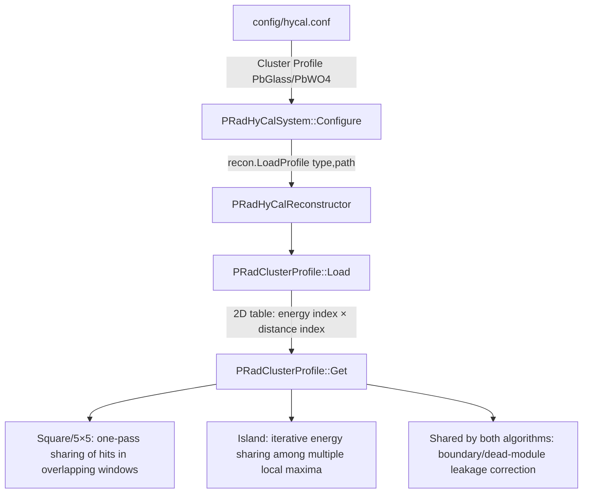
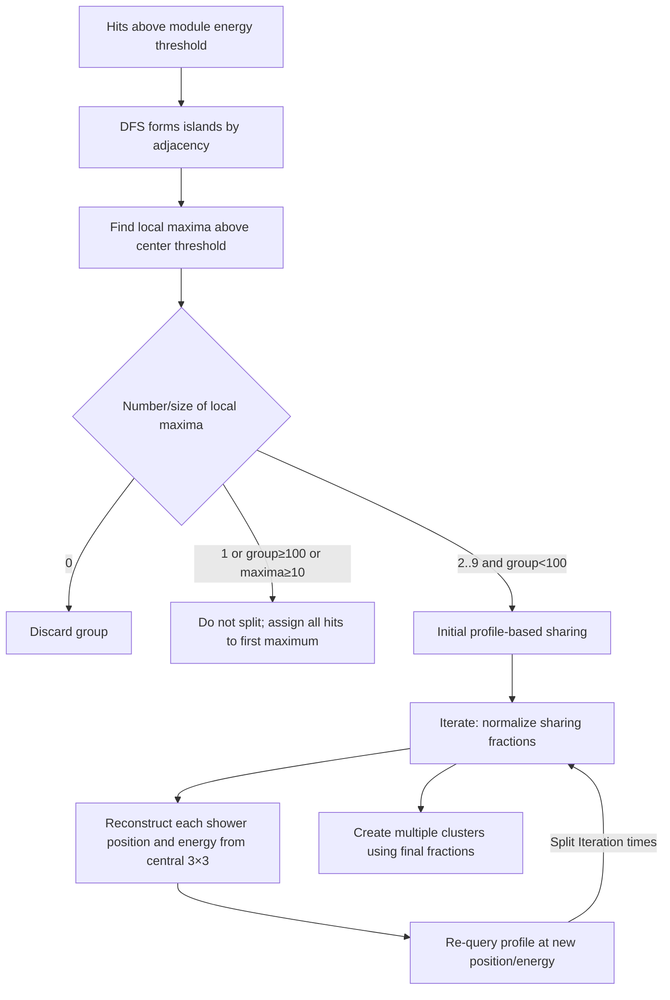

# Loading and Using the HyCal Shower Profile in PRad1 Analysis

## 1. Summary of Findings

What PRad1 Analysis informally calls the shower profile is formally named the **cluster profile** in the code and is stored by `PRadClusterProfile`. Given a cluster's total energy and the normalized distance from the cluster center to a module, it describes the fraction `frac` of cluster energy expected in that module and the uncertainty `err` on that fraction.

The complete data flow is:



The most important behaviors are:

- Profiles are separated by module material into `PbGlass` and `PbWO4` tables and are loaded centrally in `PRadHyCalSystem::Configure()`. The 5×5 and Island classes do not read the files themselves.
- Window membership in the 5×5 algorithm does not depend on the profile. The profile is used only when one hit belongs to multiple 5×5 windows, in which case its energy is shared once according to each shower's predicted contribution.
- Adjacency grouping and local-maximum finding in the Island algorithm do not depend on the profile. The profile is used to iteratively update sharing fractions only when a connected island contains multiple splittable local maxima.
- After either algorithm creates a `ModuleCluster`, it passes through the shared `LeakCorr()` step. This step also uses the profile and is where `err` actually participates in the calculation.
- `Shower Depth Correction`, `Density Profile`, and `S-shape Energy Profile` are three separate mechanisms and should not be confused with the shower/cluster profile discussed here.

## 2. Code Version and Scope Reviewed

Source project: `/home/liyuan/OL_monitor/PRadAnalyzer`

- `HEAD` at the time of review: `cb124020c0a9017fa85ecdf63b0ee5921afad106`
- The source worktree contained uncommitted changes, so this document describes the actual worktree at review time and is not guaranteed to be identical to that commit.
- Core files:
  - `config/hycal.conf`
  - `config/hycal_cluster.conf`
  - `database/cluster_profiles/prof_pwo.dat`
  - `database/cluster_profiles/prof_lg.dat`
  - `lib/prana/include/PRadClusterProfile.h`
  - `lib/prana/src/PRadClusterProfile.cpp`
  - `lib/prana/src/PRadHyCalSystem.cpp`
  - `lib/prana/src/PRadHyCalReconstructor.cpp`
  - `lib/prana/src/PRadSquareCluster.cpp`
  - `lib/prana/src/PRadIslandCluster.cpp`
  - `lib/prana/src/PRadHyCalDetector.cpp`

## 3. What the Profile Represents

### 3.1 Data Structure

`PRadClusterProfile::Value` contains two quantities:

```cpp
struct Value {
    double frac, err;
};
```

- `frac`: the expected fraction of the full shower/cluster energy received by the target module.
- `err`: the uncertainty on that fraction, used to evaluate how well the measured cluster agrees with the profile.

Each module material has one `Profile`:

```cpp
double min_ene, max_ene, step_ene;
double max_dist, step_dist;
std::vector<std::vector<Value>> values;
```

It is therefore a two-dimensional lookup table:

\[
P_t(E,d) = \bigl(f_t(E,d),\;\sigma_{f,t}(E,d)\bigr),
\]

where `t` is the module material type, `E` is the shower energy in MeV, and `d` is the dimensionless distance quantized by module size.

Source comments state that these tables come from GEANT4/PRadSim shower simulations and that the raw results were smoothed with a general neural-network-based fit (`PRadClusterProfile.cpp:8-11`). No neural-network inference occurs at runtime; the program only reads the smoothed static tables.

### 3.2 The Two Materials

The actual enumeration order of `PRadHyCalModule::Type` is:

| type | Name | Profile file |
|---:|---|---|
| 0 | `PbGlass` | `prof_lg.dat` |
| 1 | `PbWO4` | `prof_pwo.dat` |

The `PRadClusterProfile` constructor creates two slots according to `Max_Types`. Although a header comment still calls it a “singleton,” the current implementation is not a global singleton. It is a regular `profile` member of `PRadHyCalReconstructor`, shared by the Square and Island instances owned by the same reconstructor.

## 4. How the Profile Is Loaded

### 4.1 Configuration Entry Point

`config/hycal.conf:24-31`:

```ini
Cluster Method = Island
Position Method = Logarithmic
Reconstructor Configuration = ${THIS_DIR}/hycal_cluster.conf
Cluster Profile [PbWO4] = ${DB_DIR}/cluster_profiles/prof_pwo.dat
Cluster Profile [PbGlass] = ${DB_DIR}/cluster_profiles/prof_lg.dat
```

The same file first defines:

```ini
DB_DIR = ${THIS_DIR}/../database
```

`ConfigObject` first replaces `${THIS_DIR}` with the directory containing the current configuration file, then recursively expands `${DB_DIR}`. If a configuration variable does not exist, it tries the environment variable of the same name. With the repository's default configuration, the paths resolve to:

```text
/home/liyuan/OL_monitor/PRadAnalyzer/database/cluster_profiles/prof_pwo.dat
/home/liyuan/OL_monitor/PRadAnalyzer/database/cluster_profiles/prof_lg.dat
```

### 4.2 Construction and Call Chain

A typical program creates the system with `PRadHyCalSystem("config/hycal.conf")`. A non-empty path causes the constructor to call `Configure(path)`. The loading chain is:

```text
PRadHyCalSystem::PRadHyCalSystem(path)
  └─ PRadHyCalSystem::Configure(path)
       ├─ ConfigObject::Configure(path)       # read and expand hycal.conf
       ├─ recon.SetClusterMethod(...)
       ├─ recon.Configure(hycal_cluster.conf)
       └─ loop over every PRadHyCalModule::Type
            └─ recon.LoadProfile(type, path)
                 └─ PRadClusterProfile::Load(type, path)
```

`PRadHyCalSystem.cpp:261-267` dynamically constructs the key `Cluster Profile [<Type2str(i)>]`. It calls `LoadProfile()` only when the configuration value is non-empty. That method is only a thin wrapper around `profile.Load(t, path)`.

This means `Cluster Method = Island` or `Square` only selects which clustering object to create; it does not change profile loading. Both profiles are loaded by default.

### 4.3 File Format

The two default profile files use the same format. After comments and blank lines are ignored, the first line must contain exactly five fields:

```text
min_energy, max_energy, energy_step, max_distance, distance_step
```

The default values in both files are:

```text
200, 2100, 100, 5, 0.001
```

Therefore:

```text
Ne = (2100 - 200) / 100 + 1 = 20
Nd = 5 / 0.001 + 1 = 5001
```

Each subsequent valid data row has four fields:

```text
energy_index  distance_index  frac  err
```

For example, the first entry in `prof_pwo.dat` is:

```text
0  0  0.778058  0.0749555
```

At the first energy grid point, `E=200 MeV`, and at `d=0`, the central PbWO4 module therefore contains about 77.8% of the shower energy on average. Each file has 100024 lines: four comment/configuration lines plus `20 × 5001 = 100020` table entries.

`Load()` first allocates `values[Ne][Nd]`, then writes each valid `(ie,id)` entry into its corresponding location. Out-of-range rows produce a warning and are skipped. Missing grid points remain `Value(0,0)`.

## 5. How the Profile Is Queried

### 5.1 Choosing the Material and Distance

Clustering code does not call `profile.Get()` directly. It calls one of three `getProf()` overloads in the reconstructor.

1. Centered on a real seed module:

   ```cpp
   dist = center->QuantizedDist(hit.ptr);
   energy = center.energy / 0.78;
   type = center->GetType();
   ```

   This overload is used for the initial allocation of shared hits in Square and the first allocation in Island. The hard-coded `0.78` approximates the fact that the central module contains about 78% of the total shower energy, so `center.energy / 0.78` estimates the total energy.

2. Centered on a continuously reconstructed position `(cx,cy)`:

   It first finds the sector containing that coordinate and selects the profile from the sector's module type. It then calculates the quantized distance from the reconstructed point to the target module and queries the profile using the explicit `cE`. This overload is used by leakage correction.

3. Centered on a reconstructed `BaseHit`:

   This is the same as case 2, except that the energy is taken from `BaseHit::E`. It is used for Island's iterative update and for evaluating profile agreement.

`QuantizedDist` is not a distance in millimeters. It separately scales `dx` and `dy` by the module sizes in the relevant sectors and then computes:

\[
d=\sqrt{\Delta x_q^2+\Delta y_q^2}.
\]

At the PbWO4/PbGlass boundary, the line segment is split at its boundary intersection and each side is normalized by its own module size. This allows the same profile, whose horizontal axis is in module-scale units, to be used across detector regions with different module sizes.

### 5.2 Lookup and Interpolation Rules

The exact behavior of `PRadClusterProfile::Get(type, dist, energy)` is:

1. If `type` is out of range, return `(0,0)`.
2. If `dist >= max_dist`, return `(0,0)`.
3. Distance is not interpolated. The nearest grid point is used:

   \[
   i_d=\operator{int}(d/\Delta d+0.5).
   \]

4. The normalized energy coordinate is:

   \[
   u=(E-E_{min})/\Delta E,\qquad i_E=\operator{int}(u).
   \]

5. Energies below or above the table range use the first or last energy layer. Energies within the range are linearly interpolated between adjacent layers.
6. If the energy is within 5% of one energy step from a grid point, that grid point is returned directly to avoid unnecessary interpolation.
7. Both `frac` and `err` use ordinary linear interpolation; `err` is not combined in quadrature.

Although the file includes `distance_index=5000`, exactly `dist == 5` is classified as out of range first and returns zero. The last grid point is only accessible to a distance slightly below 5 that rounds to 5000.

## 6. Application in the 5×5 (Square) Algorithm

The configuration `Square Size = 5` selects `PRadSquareCluster`. Its basic flow is:

```text
Sort all module hits by descending energy
  → Check which existing seed windows contain the current hit
     → 0 windows: if Ehit > Minimum Center Energy, create a new cluster
     → 1 window: add the full hit to that cluster
     → multiple windows: use the shower profile to share the hit among clusters
```

### 6.1 The 5×5 Window Itself Does Not Use the Profile

The window test is:

\[
|x_c-x_h| \le (5/2)\,sizeX_c,
\qquad
|y_c-y_h| \le (5/2)\,sizeY_c.
\]

On a regular equal-sized grid, this includes the five rows and columns at offsets `-2..+2` from the seed. It is purely a geometric test and does not consult the shower profile.

Because hits are processed in descending energy, an earlier hit above the center threshold becomes a seed. A hit that lies inside an existing window cannot later become a new seed.

### 6.2 The Profile Is Used Only for Overlapping Windows

If hit `j` belongs to multiple clusters `i`, `splitHit()` calculates an unnormalized weight for every candidate:

\[
w_{ij}=f_{t_i}\!\left(E_{c_i}/0.78,d_{ij}\right)\,E_{c_i},
\]

where `E_ci` is the seed/center module energy, not the cluster's accumulated total energy. The hit energy is then split as:

\[
E_{ij}=E_j\frac{w_{ij}}{\sum_k w_{kj}}.
\]

Each energy share is placed in a copied `ModuleHit` and added to the corresponding cluster. `ModuleCluster::AddHit()` also accumulates the cluster's total energy.

If the sum of all profile weights is zero—typically because the quantized distance to every seed exceeds `max_dist`, or because a profile was not loaded correctly—`splitHit()` returns false. The outer loop may then turn this hit into a new seed if it still exceeds `Minimum Center Energy`. The source comment saying “discard it” is therefore not completely accurate.

### 6.3 What the Profile Does Not Do in Square

- It does not determine the 5×5 window boundary.
- It does not participate when a hit belongs to only one window.
- It does not iteratively update shower position or energy.
- Energy sharing uses only `frac`, not `err`.

The profile's central role in Square is therefore a one-pass “overlapping-window competition.”

## 7. Application in the Island Algorithm

Island has two layers: topological island formation and multi-peak splitting.



### 7.1 Island Formation and Peak Finding Do Not Use the Profile

- `groupHits()` uses DFS to form connected groups of adjacent modules. With `Corner Connection=false`, diagonal contact does not connect groups.
- `findMaximums()` always includes corner neighbors when checking local maxima and requires candidate energy to be at least `Minimum Center Energy`.
- If there is only one maximum, the group contains at least 100 hits, or it contains at least 10 maxima, profile-based splitting is skipped and all hits are assigned to the first maximum.

Not every Island cluster therefore queries the shower profile.

### 7.2 Initial Sharing Fractions

For a splittable multi-peak island, the initial value for hit `j` and maximum `i` is:

\[
F_{ji}^{(0)}
= f_{t_i}\!\left(E_{center,i}/0.78,d(center_i,hit_j)\right)
  E_{center,i}.
\]

The normalized sharing fraction is:

\[
r_{ji}^{(n)}=\frac{F_{ji}^{(n)}}{\sum_kF_{jk}^{(n)}}.
\]

This is the same initial formula used by Square, but Island subsequently refines it iteratively.

### 7.3 Iterative Update

The default is `Split Iteration = 6`. On every pass, for each maximum `i`:

1. Start from the seed-center energy: `tot_E = center.energy`.
2. Use only hits around the seed with quantized coordinates satisfying `|dx| < 1.01 && |dy| < 1.01`, i.e. the central 3×3.
3. The participating energy of each 3×3 hit in shower `i` is:

   \[
   E_{ji}^{(n)}=E_j r_{ji}^{(n)}.
   \]

4. Add these participating energies to `tot_E` and reconstruct a continuous shower position with the configured position method. The default is logarithmic weighting:

   \[
   w_j=\max\left(0,\;3.6+\ln(E_{ji}/E_{tot})\right).
   \]

5. Re-query the profile for all hits in the group using the new position and `tot_E`:

   \[
   F_{ji}^{(n+1)}
   = f_{t_i}\!\left(E_{tot,i}^{(n)},d(recon_i^{(n)},hit_j)\right)
     E_{tot,i}^{(n)}.
   \]

At this stage, the material type is no longer taken directly from the original seed. It comes from the sector containing the reconstructed coordinate. Near the PbWO4/PbGlass boundary, the profile selected during iteration can therefore change as the reconstructed position moves.

### 7.4 Writing the Final Clusters

The normalized fraction for every hit is recalculated after iteration. If a share satisfies `r_ji < Least Split Fraction`, with a default of 0.01, it is treated as zero. Otherwise:

\[
E_{ji}=E_jr_{ji}
\]

is written into the new cluster corresponding to maximum `i`, and the `kSplit` flag is set. If the shared hit is the cluster's center module, `cluster.center.energy` is updated as well.

Splitting uses profile `frac` but not `err`.

One implementation detail is worth preserving: while processing clusters sequentially, the source modifies a hit's `total` when a share below 1% is removed. A later cluster can therefore see a denominator that has already changed, while shares already written to earlier clusters are not renormalized retroactively. This makes the existing implementation order-dependent; it is not equivalent to removing all `<1%` entries first and then normalizing once.

## 8. Leakage Correction Shared by Both Algorithms

`ReconstructHits()` runs in this order:

```text
cluster->FormCluster(...)
  → CheckCluster(...)
  → LeakCorr(cluster)
  → Cluster2Hit(cluster)
```

Clusters formed by both Square and Island can therefore use the profile for leakage correction. The correction is triggered when:

- `Leakage Correction = true`;
- the cluster does not already have `kLeakCorr` set;
- the cluster has at least four hits;
- the center module has virtual neighbors representing dead modules, the inner hole, or the outer boundary.

### 8.1 Estimating Energy in Virtual Modules

The current cluster first reconstructs a position `hit`, then queries each virtual hit:

\[
f_v=f_t(E_{cluster},d(hit,v)).
\]

Only when:

\[
LeastLeakageFraction < f_v < 1
\]

is the virtual hit assigned energy:

\[
E_v=E_{current}\,f_v.
\]

The default `Least Leakage Fraction` is 0.01. After virtual energy is added, the position is reconstructed again using real and virtual hits in the central 3×3, and the candidate total energy is updated.

### 8.2 Using `frac` and `err` to Accept or Reject an Iteration

For real hits whose predicted profile fraction is at least 1%, `EvalCluster()` calculates:

\[
\Delta_j=E_j-E_c f_j,
\]

\[
\sigma_j^2=E_c^2\sigma_{f,j}^2+
             \sigma_E(E_c)^2f_j^2,
\]

\[
est=\frac{1}{N}\sum_j\frac{|\Delta_j|}{\sqrt{\sigma_j^2}}.
\]

The code comment describes this as a log-likelihood-like estimator for a double-exponential distribution. After each leakage iteration, the new state is retained only if `est` decreases. Otherwise, virtual energies are restored to the previous iteration and correction stops. The default maximum is six iterations.

Finally, positive-energy virtual hits are added to the cluster, increasing `cluster.energy` and `cluster.leakage`, and `kLeakCorr` is set. This is where profile `err` is consumed during reconstruction.

## 9. Side-by-Side Comparison of Square and Island

| Stage | Square / 5×5 | Island |
|---|---|---|
| Basic grouping rule | Fixed square around each seed | Topological connectivity of hits |
| Does the profile set grouping boundaries? | No | No |
| When does the profile enter primary clustering? | A hit belongs to multiple windows | An island has multiple local maxima and is small enough to split |
| Initial energy estimate | `center.energy / 0.78` | `center.energy / 0.78` |
| Initial weight | `profile.frac × center.energy` | `profile.frac × center.energy` |
| Iterative? | No | Yes, six passes by default |
| Iterative position | None | Weighted central 3×3 position for each shower |
| Small-share threshold | No dedicated threshold | Remove shares `< 1%` |
| Does primary clustering use `err`? | No | No |
| Subsequent leakage correction | Yes, when trigger conditions are met | Yes, when trigger conditions are met |

## 10. Other Easily Confused Profiles and Corrections

### 10.1 Shower Depth Correction

`Shower Depth Correction` only adjusts the final hit's z coordinate. It uses hard-coded radiation-length and critical-energy formulas based on material and energy and never reads `prof_*.dat`.

### 10.2 Density Profile

`Density Profile [Set_1GeV/Set_2GeV]` corrects position-reconstruction bias and is loaded separately by `PRadClusterDensity`. It is not the two-dimensional radial shower-fraction table discussed here.

### 10.3 S-Shape Energy Profile

`S-shape Energy Profile` corrects final energy bias. It is also managed by `PRadClusterDensity` and is separate from the `PRadClusterProfile` used for clustering energy sharing.

## 11. Behavior That Must Be Preserved When Porting or Reproducing the Algorithm

At minimum, an implementation reproducing PRad1 behavior in PRad2 or elsewhere must explicitly preserve:

1. Separate two-dimensional `energy × quantized-distance` tables for `PbGlass` and `PbWO4`.
2. Module-scale distance normalization, including correct handling of the PbWO4/PbGlass boundary.
3. Nearest-grid-point distance lookup, linear energy interpolation, endpoint clamping outside the energy range, and zero for `dist >= 5`.
4. Use of `center.energy / 0.78` for the first estimate of total shower energy.
5. Square uses the profile only for competition among multiple windows and performs only one allocation pass.
6. Island first forms topological islands and finds local peaks, then iterates the profile only for splittable multi-peak groups.
7. Each Island iteration uses only the central 3×3 to reconstruct position but recalculates profile weights over the full group using the updated position.
8. Both primary splitters use only `frac`; `err` is used in the shared leakage-candidate evaluation.
9. Leakage correction runs after cluster formation and quality selection but before the final `HyCalHit` is created.

## 12. Boundary Conditions and Risks in the Current Implementation

- **No explicit loaded state.** If a configuration key is missing, the system skips `Load()` for that material. If the file cannot be opened or its header cannot be parsed, the `Profile` may have no valid dimensions, but subsequent lookup has no common “loaded” check. A robust port should add a `loaded/valid` flag.
- **Missing table entries silently remain zero.** `Resize()` creates default `(0,0)` entries and does not verify that all `Ne × Nd` entries are present.
- **Only the upper distance bound is handled explicitly.** Normal geometry should guarantee non-negative distance, but `Get()` has no dedicated protection against a negative value.
- **Island's temporary container is static.** `splitHits()` uses `static SplitContainer split`, so concurrent event reconstruction through the same reconstructor is not inherently thread-safe.
- **`EvalCluster()` assumes at least one hit has `frac >= 0.01`.** Otherwise, `count==0` causes division by zero. A valid loaded profile and normal cluster generally prevent this, but the code does not guard it explicitly.
- **Square checks material-boundary window membership using the center module's physical size.** The 5×5 geometric selection does not use cross-material `QuantizedDist`, while profile weighting does. Near a boundary, “inside the window” and “shower distance” therefore use different geometric criteria.

## 13. Key Source Locations

| Topic | File and lines at review time |
|---|---|
| Profile path configuration | `config/hycal.conf:24-31` |
| Main profile-loading entry point | `lib/prana/src/PRadHyCalSystem.cpp:233-267` |
| Data structures | `lib/prana/include/PRadClusterProfile.h:11-50` |
| File loading | `lib/prana/src/PRadClusterProfile.cpp:31-84` |
| Lookup/interpolation | `lib/prana/src/PRadClusterProfile.cpp:87-124` |
| Three `getProf()` adapters | `lib/prana/src/PRadHyCalReconstructor.cpp:707-738` |
| Quantized distance and cross-material handling | `lib/prana/src/PRadHyCalDetector.cpp:19-70, 768-819` |
| Square 5×5 membership | `lib/prana/src/PRadSquareCluster.cpp:34-109` |
| Square overlap energy sharing | `lib/prana/src/PRadSquareCluster.cpp:111-150` |
| Island formation/peak finding | `lib/prana/src/PRadIslandCluster.cpp:53-169` |
| Island initial/final sharing | `lib/prana/src/PRadIslandCluster.cpp:171-222` |
| Island iterative update | `lib/prana/src/PRadIslandCluster.cpp:224-274` |
| Shared leakage correction | `lib/prana/src/PRadHyCalReconstructor.cpp:447-571` |
| Related default parameters | `config/hycal_cluster.conf:1-33` |
