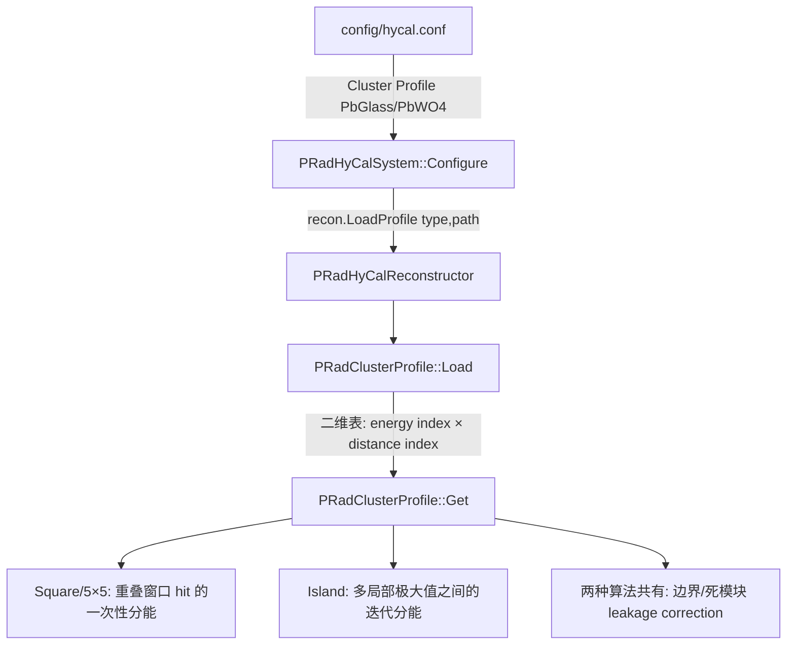
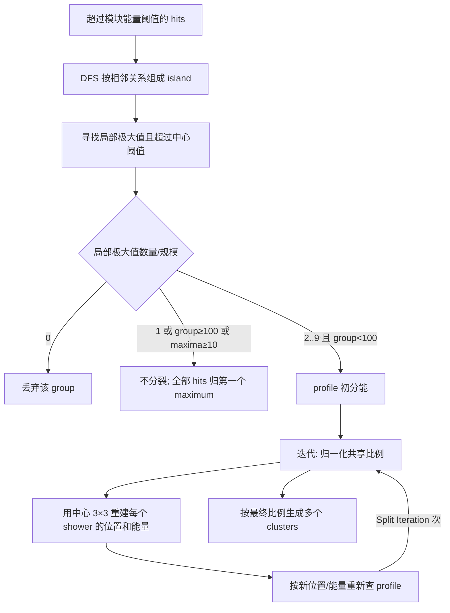

# PRad1 Analysis 中 HyCal shower profile 的加载与使用

## 1. 结论摘要

PRad1 Analysis 中所谓的 shower profile，在代码里正式命名为 **cluster profile**，由 `PRadClusterProfile` 保存。它描述：给定簇总能量、簇中心到某个模块的归一化距离时，该模块预计接收的簇能量比例 `frac`，以及该比例的不确定度 `err`。

它的完整数据流是：



最重要的行为是：

- profile 按模块材料分成 `PbGlass` 和 `PbWO4` 两套，在 `PRadHyCalSystem::Configure()` 时统一加载；并不是由 5×5 或 island 类自己读文件。
- 5×5 算法的窗口归属不依赖 profile。只有某个 hit 同时属于多个 5×5 窗口时，才按各 shower 的预测贡献做一次分能。
- island 的相邻连通分组和局部极大值搜索不依赖 profile。只有一个连通岛里存在多个可分裂的局部极大值时，才用 profile 反复更新共享比例。
- 两种算法生成 `ModuleCluster` 后，统一进入 `LeakCorr()`；这一步也使用 profile，并且这是 `err` 真正参与计算的位置。
- `Shower Depth Correction`、`Density Profile`、`S-shape Energy Profile` 是另外三套机制，不应与本文的 shower/cluster profile 混为一谈。

## 2. 本文检查的代码版本和范围

源项目：`/home/liyuan/OL_monitor/PRadAnalyzer`

- 检查时 `HEAD`：`cb124020c0a9017fa85ecdf63b0ee5921afad106`
- 源工作区存在未提交修改，因此本文描述的是检查当时的实际工作树，不保证完全等同于上述 commit。
- 核心文件：
  - `config/hycal.conf`
  - `config/hycal_cluster.conf`
  - `database/cluster_profiles/prof_pwo.dat`
  - `database/cluster_profiles/prof_lg.dat`
  - `lib/prana/include/PRadClusterProfile.h`
  - `lib/prana/src/PRadClusterProfile.cpp`
  - `lib/prana/src/PRadHyCalSystem.cpp`
  - `lib/prana/src/PRadHyCalReconstructor.cpp`
  - `lib/prana/src/PRadSquareCluster.cpp`
  - `lib/prana/src/PRadIslandCluster.cpp`
  - `lib/prana/src/PRadHyCalDetector.cpp`

## 3. Profile 表示什么

### 3.1 数据结构

`PRadClusterProfile::Value` 有两个量：

```cpp
struct Value {
    double frac, err;
};
```

- `frac`：目标模块预计获得的能量占整个 shower/cluster 能量的比例。
- `err`：该比例的误差，用于评价实测簇与 profile 的符合程度。

每种模块材料对应一个 `Profile`：

```cpp
double min_ene, max_ene, step_ene;
double max_dist, step_dist;
std::vector<std::vector<Value>> values;
```

因此它本质上是二维查找表：

\[
P_t(E,d) = \bigl(f_t(E,d),\;\sigma_{f,t}(E,d)\bigr),
\]

其中 `t` 是模块材料类型，`E` 是 shower 能量（MeV），`d` 是以模块尺寸量化后的无量纲距离。

源码注释说明，这套表来自 GEANT4/PRadSim shower 模拟，原始结果又经过基于神经网络的一般拟合进行平滑（`PRadClusterProfile.cpp:8-11`）。运行时没有神经网络推理；程序只读取平滑后的静态表。

### 3.2 两种材料

`PRadHyCalModule::Type` 的实际枚举顺序是：

| type | 名称 | profile 文件 |
|---:|---|---|
| 0 | `PbGlass` | `prof_lg.dat` |
| 1 | `PbWO4` | `prof_pwo.dat` |

`PRadClusterProfile` 构造时按 `Max_Types` 建立两个槽位。源码头部虽然还留有“singleton”注释，但当前实现并不是全局 singleton；它是 `PRadHyCalReconstructor` 的普通成员 `profile`，由同一个 reconstructor 下的 Square 和 Island 实例共享。

## 4. Profile 如何加载进来

### 4.1 入口配置

`config/hycal.conf:24-31`：

```ini
Cluster Method = Island
Position Method = Logarithmic
Reconstructor Configuration = ${THIS_DIR}/hycal_cluster.conf
Cluster Profile [PbWO4] = ${DB_DIR}/cluster_profiles/prof_pwo.dat
Cluster Profile [PbGlass] = ${DB_DIR}/cluster_profiles/prof_lg.dat
```

同一文件先定义：

```ini
DB_DIR = ${THIS_DIR}/../database
```

`ConfigObject` 先把 `${THIS_DIR}` 替换成当前配置文件所在目录，再递归展开 `${DB_DIR}`。若配置变量不存在，则会尝试同名环境变量。按仓库内默认配置，最终路径分别解析为：

```text
/home/liyuan/OL_monitor/PRadAnalyzer/database/cluster_profiles/prof_pwo.dat
/home/liyuan/OL_monitor/PRadAnalyzer/database/cluster_profiles/prof_lg.dat
```

### 4.2 构造与调用链

典型程序以 `PRadHyCalSystem("config/hycal.conf")` 创建系统。非空路径使构造函数调用 `Configure(path)`。加载链为：

```text
PRadHyCalSystem::PRadHyCalSystem(path)
  └─ PRadHyCalSystem::Configure(path)
       ├─ ConfigObject::Configure(path)       # 读取并展开 hycal.conf
       ├─ recon.SetClusterMethod(...)
       ├─ recon.Configure(hycal_cluster.conf)
       └─ 对每个 PRadHyCalModule::Type 循环
            └─ recon.LoadProfile(type, path)
                 └─ PRadClusterProfile::Load(type, path)
```

`PRadHyCalSystem.cpp:261-267` 动态组成键名 `Cluster Profile [<Type2str(i)>]`。配置值非空才调用 `LoadProfile()`。后者只是 `profile.Load(t, path)` 的薄封装。

这意味着 `Cluster Method = Island` 或 `Square` 只决定创建哪个 clustering 对象，不改变 profile 的加载方式；两套 profile 默认都会加载。

### 4.3 文件格式

两个默认 profile 文件格式相同。忽略注释和空行后，第一行必须恰好有 5 项：

```text
min_energy, max_energy, energy_step, max_distance, distance_step
```

默认值均为：

```text
200, 2100, 100, 5, 0.001
```

所以：

```text
Ne = (2100 - 200) / 100 + 1 = 20
Nd = 5 / 0.001 + 1 = 5001
```

接下来的每个有效数据行有 4 项：

```text
energy_index  distance_index  frac  err
```

例如 `prof_pwo.dat` 的第一项是：

```text
0  0  0.778058  0.0749555
```

即在第一个能量格点 `E=200 MeV`、`d=0` 时，中心 PbWO4 模块平均包含约 77.8% 的 shower 能量。每个文件有 100024 行：4 行注释/配置加 `20 × 5001 = 100020` 个表项。

`Load()` 先按上述维度分配 `values[Ne][Nd]`，再把合法的 `(ie,id)` 写入对应位置。越界行只警告并跳过；缺失格点保持 `Value(0,0)`。

## 5. Profile 如何查询

### 5.1 材料和距离的选择

聚类代码不直接调用 `profile.Get()`，而是调用 reconstructor 的三个 `getProf()` 重载。

1. 以真实 seed 模块为中心：

   ```cpp
   dist = center->QuantizedDist(hit.ptr);
   energy = center.energy / 0.78;
   type = center->GetType();
   ```

   这个重载用于 Square 的共享 hit 初分配，以及 Island 的第一次初分配。`0.78` 是硬编码近似：中心模块约含总 shower 能量的 78%，所以用 `center.energy / 0.78` 估计总能量。

2. 以连续重建位置 `(cx,cy)` 为中心：

   先找该坐标所在 sector，以该 sector 的模块类型选 profile；再计算重建点到目标模块的量化距离，并用显式给出的 `cE` 查询。这用于 leakage correction。

3. 以 `BaseHit` 重建结果为中心：

   与第 2 种相同，但能量取 `BaseHit::E`。这用于 Island 的迭代更新及 profile 符合度评价。

`QuantizedDist` 不是毫米距离，而是分别用所在 sector 的模块尺寸缩放 `dx`、`dy` 后计算：

\[
d=\sqrt{\Delta x_q^2+\Delta y_q^2}.
\]

在 PbWO4/PbGlass 边界处，线段会在边界交点处分段，分别用两侧模块尺寸归一化。这让同一张以“模块尺度”为横轴的 profile 可以跨不同尺寸的探测器区域使用。

### 5.2 查表与插值规则

`PRadClusterProfile::Get(type, dist, energy)` 的精确行为是：

1. `type` 越界：返回 `(0,0)`。
2. `dist >= max_dist`：返回 `(0,0)`。
3. 距离不插值，而是取最近格点：

   \[
   i_d=\operator{int}(d/\Delta d+0.5).
   \]

4. 能量位置为：

   \[
   u=(E-E_{min})/\Delta E,\qquad i_E=\operator{int}(u).
   \]

5. 能量低于/高于表范围时取首/末能量层；在范围内对相邻能量层线性插值。
6. 若距某一能量格点小于一个步长的 5%，直接返回该格点，避免不必要插值。
7. `frac` 和 `err` 都做普通线性插值；`err` 不是按方差合成。

注意，虽然文件包含 `distance_index=5000`，但恰好 `dist == 5` 会先被判定为越界并返回零；该末格点只可能被略小于 5、但四舍五入到 5000 的距离访问。

## 6. 在 5×5（Square）算法中的应用

配置 `Square Size = 5` 对应 `PRadSquareCluster`。其基本流程是：

```text
所有模块 hit 按能量从高到低排序
  → 对当前 hit 检查它落入哪些已存在 seed 的方窗
     → 0 个：若 Ehit > Minimum Center Energy，则新建 cluster
     → 1 个：整个 hit 加入该 cluster
     → 多个：用 shower profile 在这些 cluster 之间分能
```

### 6.1 5×5 窗口本身不使用 profile

窗口判断是：

\[
|x_c-x_h| \le (5/2)\,sizeX_c,
\qquad
|y_c-y_h| \le (5/2)\,sizeY_c.
\]

在规则等尺寸网格上，这包含相对 seed 的 `-2..+2` 五行五列。它只是几何判断，不看 shower profile。

由于 hits 已按能量降序处理，早先遇到且超过中心阈值的 hit 会成为 seed。落入已有窗口的 hit 不再成为新 seed。

### 6.2 仅在多个窗口重叠时用 profile 分能

若 hit `j` 同时属于多个 cluster `i`，`splitHit()` 为每个候选计算未归一化权重：

\[
w_{ij}=f_{t_i}\!\left(E_{c_i}/0.78,d_{ij}\right)\,E_{c_i},
\]

其中 `E_ci` 是 seed/center 模块能量，不是当前 cluster 的累计总能量。随后把 hit 能量分为：

\[
E_{ij}=E_j\frac{w_{ij}}{\sum_k w_{kj}}.
\]

每份能量以复制的 `ModuleHit` 加到对应 cluster，`ModuleCluster::AddHit()` 同时累加 cluster 总能量。

若所有 profile 权重之和为零（典型情况是到所有 seed 的量化距离都超出 `max_dist`，或 profile 未正确加载），`splitHit()` 返回 false；外层随后可能把这个 hit 当作新 seed，条件是它还超过 `Minimum Center Energy`。因此源码注释说“discard it”并不完全准确。

### 6.3 Square 中 profile 不做什么

- 不决定 5×5 的窗口边界。
- 不参与只属于一个窗口的 hit。
- 不迭代更新 shower 位置或能量。
- 分能时只用 `frac`，不用 `err`。

所以 Square 对 profile 的核心使用是一次性的“重叠窗口竞争”。

## 7. 在 Island 算法中的应用

Island 的流程分成“拓扑分岛”和“多峰分裂”两层：



### 7.1 分岛与找峰不使用 profile

- `groupHits()` 用 DFS 将相邻模块组成连通组。`Corner Connection=false` 时分组不通过角相邻连接。
- `findMaximums()` 检查局部极大值时固定把角邻居也算进去，并要求候选能量不低于 `Minimum Center Energy`。
- 若只有一个 maximum，或 group hit 数量达到 100，或 maximum 数量达到 10，则不进行 profile 分裂，所有 hits 归属于第一个 maximum。

因此，并非每个 island cluster 都会查询 shower profile。

### 7.2 初始共享比例

对可分裂的多峰 island，针对 hit `j` 和 maximum `i` 初始化：

\[
F_{ji}^{(0)}
= f_{t_i}\!\left(E_{center,i}/0.78,d(center_i,hit_j)\right)
  E_{center,i}.
\]

归一化共享比例为：

\[
r_{ji}^{(n)}=\frac{F_{ji}^{(n)}}{\sum_kF_{jk}^{(n)}}.
\]

这和 Square 的初始公式相同，但 Island 随后会迭代细化。

### 7.3 迭代更新

默认 `Split Iteration = 6`。每一轮针对每个 maximum `i`：

1. 从 seed 中心能量开始：`tot_E = center.energy`。
2. 仅使用 seed 周围量化坐标满足 `|dx| < 1.01 && |dy| < 1.01` 的 3×3 hits。
3. 每个 3×3 hit 对 shower `i` 的参与能量为：

   \[
   E_{ji}^{(n)}=E_j r_{ji}^{(n)}.
   \]

4. 把这些参与能量加入 `tot_E`，并用配置的 position method 重建连续 shower 位置。默认是 logarithmic weighting：

   \[
   w_j=\max\left(0,\;3.6+\ln(E_{ji}/E_{tot})\right).
   \]

5. 用新位置和 `tot_E` 对 group 内所有 hits 重新查询 profile：

   \[
   F_{ji}^{(n+1)}
   = f_{t_i}\!\left(E_{tot,i}^{(n)},d(recon_i^{(n)},hit_j)\right)
     E_{tot,i}^{(n)}.
   \]

这里材料类型不再直接取原 seed，而是取重建坐标所在 sector 的材料类型。跨 PbWO4/PbGlass 边界时，迭代中选用的 profile 可能随重建位置变化。

### 7.4 最终写入 clusters

迭代结束后再次计算每个 hit 的归一化比例。若某份 `r_ji < Least Split Fraction`（默认 0.01），该份被视为零；否则：

\[
E_{ji}=E_jr_{ji}
\]

被写入 maximum `i` 对应的新 cluster，并设置 `kSplit` 标志。若共享 hit 恰好是该 cluster 的中心模块，还会同步更新 `cluster.center.energy`。

分裂过程使用 profile 的 `frac`，不使用 `err`。

一个值得保留的实现细节是：源码在逐 cluster 处理小于 1% 的份额时会修改该 hit 的 `total`，所以后处理的 cluster 看到的分母可能已经变化；此前已经写入的份额不会回头重新归一化。这是现有实现的顺序相关行为，而不是纯粹一次性地把所有 `<1%` 项删除后统一归一化。

## 8. 两种算法共有的 leakage correction

`ReconstructHits()` 的顺序是：

```text
cluster->FormCluster(...)
  → CheckCluster(...)
  → LeakCorr(cluster)
  → Cluster2Hit(cluster)
```

因此 Square 和 Island 形成的 cluster 都可能使用 profile 做漏能修正。触发条件为：

- `Leakage Correction = true`；
- cluster 尚未设置 `kLeakCorr`；
- cluster 至少 4 个 hits；
- 中心模块有 virtual neighbors（死模块、内孔或外边界对应的虚拟邻居）。

### 8.1 给虚拟模块估能

先由现有 cluster 重建位置 `hit`，然后对每个 virtual hit 查询：

\[
f_v=f_t(E_{cluster},d(hit,v)).
\]

仅当：

\[
LeastLeakageFraction < f_v < 1
\]

时，给它能量：

\[
E_v=E_{current}\,f_v.
\]

默认 `Least Leakage Fraction = 0.01`。加入虚拟能量后，使用真实 hits 加虚拟 hits 的中心 3×3 再重建位置，并更新候选总能量。

### 8.2 用 `frac` 和 `err` 选择是否接受迭代

`EvalCluster()` 对 profile 预测比例至少为 1% 的真实 hit 计算：

\[
\Delta_j=E_j-E_c f_j,
\]

\[
\sigma_j^2=E_c^2\sigma_{f,j}^2+
             \sigma_E(E_c)^2f_j^2,
\]

\[
est=\frac{1}{N}\sum_j\frac{|\Delta_j|}{\sqrt{\sigma_j^2}}.
\]

代码注释把它描述为 double-exponential distribution 的 log-likelihood 型估计量。每次 leakage 迭代后，只有 `est` 变小才保留新状态；否则恢复上一轮虚拟能量并停止。默认最多 6 轮。

最终正能量虚拟 hits 被加入 cluster，增加 `cluster.energy` 和 `cluster.leakage`，并设置 `kLeakCorr`。这是整个重建中 profile 的 `err` 被消费的地方。

## 9. Square 与 Island 的并列对比

| 环节 | Square / 5×5 | Island |
|---|---|---|
| 基本成组依据 | seed 周围固定方窗 | hit 的拓扑连通性 |
| profile 决定成组边界吗 | 否 | 否 |
| profile 何时参与主聚类 | hit 同时属于多个窗口 | 一个 island 有多个且规模可处理的局部极大值 |
| 初始能量估计 | `center.energy / 0.78` | `center.energy / 0.78` |
| 初始权重 | `profile.frac × center.energy` | `profile.frac × center.energy` |
| 是否迭代 | 否 | 是，默认 6 次 |
| 迭代位置 | 无 | 各 shower 中心 3×3 的加权位置 |
| 小份额阈值 | 无专用阈值 | `< 1%` 删除 |
| 主聚类是否使用 `err` | 否 | 否 |
| 后续 leakage correction | 会，满足触发条件时 | 会，满足触发条件时 |

## 10. 容易混淆的其他“profile/correction”

### 10.1 Shower depth correction

`Shower Depth Correction` 只修正最终 hit 的 z 坐标。它根据材料和能量使用硬编码的辐射长度、临界能量公式，完全不读取 `prof_*.dat`。

### 10.2 Density profile

`Density Profile [Set_1GeV/Set_2GeV]` 用于位置重建偏差修正，由 `PRadClusterDensity` 单独加载，不是本文件讨论的二维径向 shower fraction 表。

### 10.3 S-shape energy profile

`S-shape Energy Profile` 用于最终能量偏差修正，也由 `PRadClusterDensity` 管理，与聚类分能用的 `PRadClusterProfile` 分开。

## 11. 移植或复现时必须保留的行为

若要在 PRad2 或其他实现里复刻 PRad1 行为，至少要明确保留：

1. 按 `PbGlass/PbWO4` 分开的二维 `energy × quantized-distance` 表。
2. 距离使用模块尺度归一化，并正确处理 PbWO4/PbGlass 边界。
3. 距离取最近格点；能量线性插值；能量范围外夹到端点；`dist >= 5` 返回零。
4. 第一次估 shower 总能量时使用 `center.energy / 0.78`。
5. Square 只在多窗口竞争时用 profile，并且只做一次分配。
6. Island 先拓扑分岛、找局部峰，再对可分裂多峰组做 profile 迭代。
7. Island 每轮只用中心 3×3 重建位置，但用更新后的位置对整个 group 重新计算 profile 权重。
8. 两种主分裂都只用 `frac`；`err` 用在共有的 leakage candidate 评价中。
9. leakage correction 位于 cluster 形成和质量筛选之后、最终 `HyCalHit` 生成之前。

## 12. 当前实现的边界条件与风险

- **缺少显式 loaded 状态。** 如果配置缺项，系统会跳过相应材料的 `Load()`；如果文件打开或表头解析失败，`Profile` 可能没有有效维度，但后续查询没有统一的“是否已加载”检查。可靠移植时应增加 `loaded/valid` 标志。
- **缺失表项静默为零。** `Resize()` 产生默认 `(0,0)`，不验证 `Ne × Nd` 是否完整。
- **异常距离仅处理上界。** 正常几何应保证距离非负；`Get()` 没有专门防御负距离。
- **Island 的临时容器是静态对象。** `splitHits()` 使用 `static SplitContainer split`，同一 reconstructor 的并发事件重建不是天然线程安全的。
- **`EvalCluster()` 假定至少一个 `frac >= 0.01` 的 hit。** 否则 `count==0` 时会发生除零；正常已加载 profile 和有效 cluster 通常避免该情况，但代码没有显式保护。
- **Square 的材料边界窗口是以中心模块物理尺寸判断。** 5×5 几何选择并没有使用跨材料的 `QuantizedDist`，而 profile 权重使用了它；边界附近的“入窗”和“shower 距离”不是同一套几何判据。

## 13. 关键源码定位

| 内容 | 文件与行号（检查时） |
|---|---|
| profile 路径配置 | `config/hycal.conf:24-31` |
| profile 加载总入口 | `lib/prana/src/PRadHyCalSystem.cpp:233-267` |
| 数据结构 | `lib/prana/include/PRadClusterProfile.h:11-50` |
| 文件读取 | `lib/prana/src/PRadClusterProfile.cpp:31-84` |
| 查表/插值 | `lib/prana/src/PRadClusterProfile.cpp:87-124` |
| 三个 `getProf()` 适配器 | `lib/prana/src/PRadHyCalReconstructor.cpp:707-738` |
| 量化距离及跨材料处理 | `lib/prana/src/PRadHyCalDetector.cpp:19-70, 768-819` |
| Square 5×5 归属 | `lib/prana/src/PRadSquareCluster.cpp:34-109` |
| Square 重叠分能 | `lib/prana/src/PRadSquareCluster.cpp:111-150` |
| Island 分岛/找峰 | `lib/prana/src/PRadIslandCluster.cpp:53-169` |
| Island 初始与最终分能 | `lib/prana/src/PRadIslandCluster.cpp:171-222` |
| Island 迭代更新 | `lib/prana/src/PRadIslandCluster.cpp:224-274` |
| 共有 leakage correction | `lib/prana/src/PRadHyCalReconstructor.cpp:447-571` |
| 相关默认参数 | `config/hycal_cluster.conf:1-33` |

