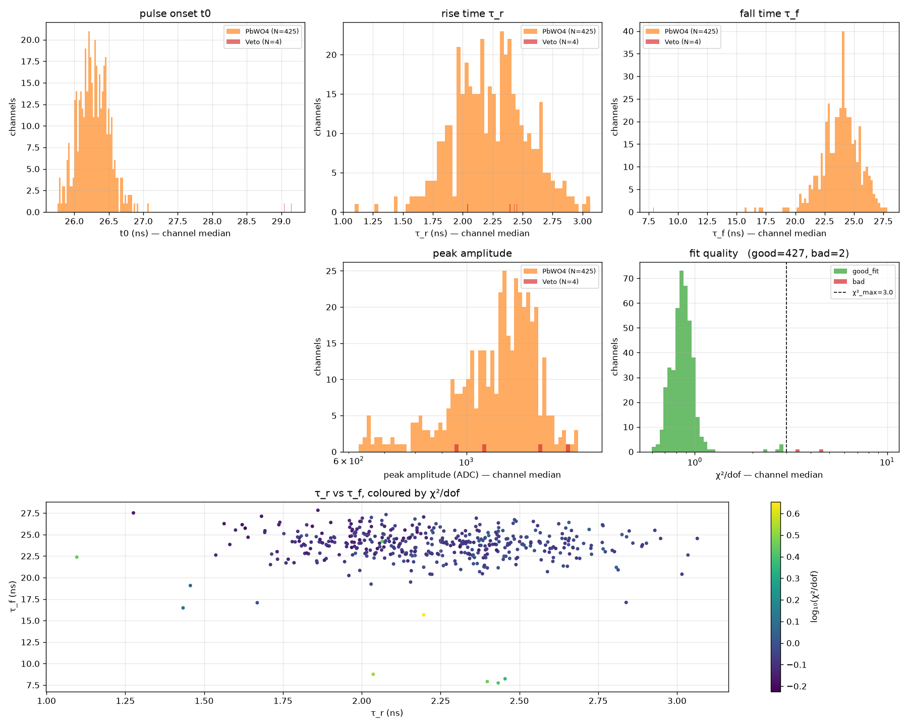
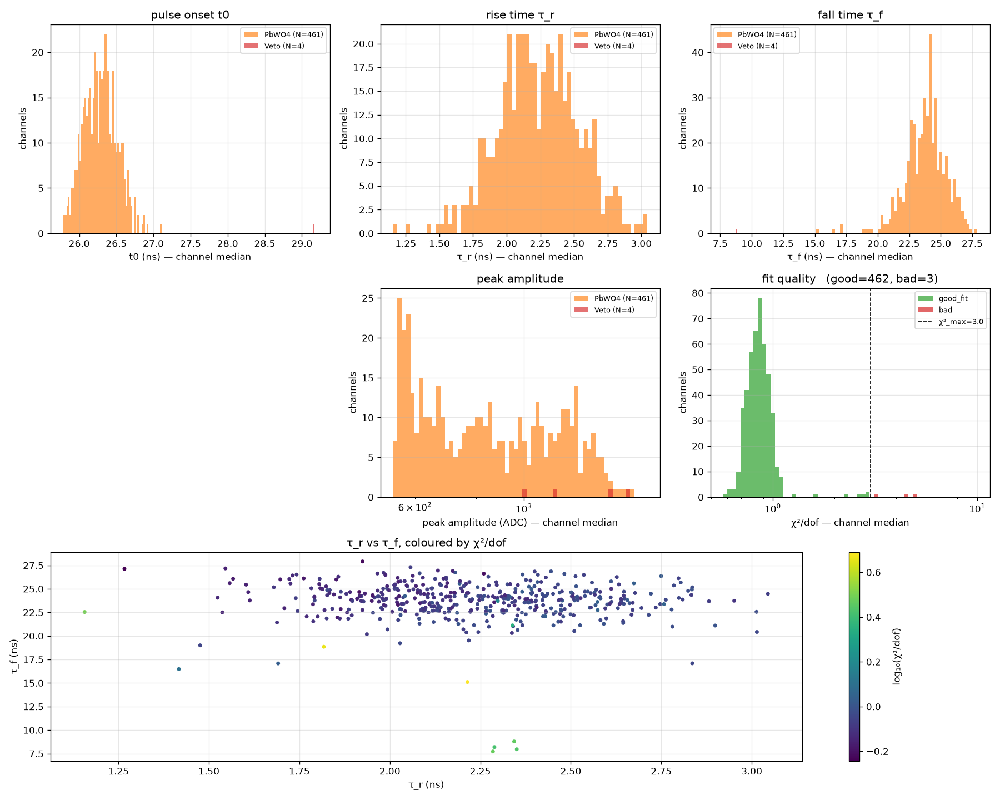
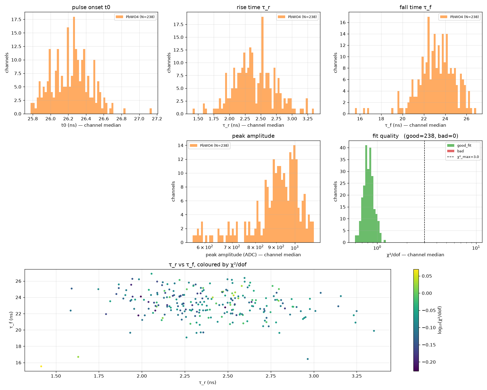

# PbWO4 Pulse Template Extraction: `fit_pulse_template.py`

**Author:** Jingyi Zhou (jyzhou), documented 2026-09-16.

## 1. Purpose

This note documents the clean per-material template extraction for PbWO4, ready for use by the
pile-up deconvolver. For the underlying `WaveAnalyzer::FitPulseShape` algorithm and the parametric
two-tau template model, see [`wave_analysis.md`](wave_analysis.md).

## 2. Results

### 2a. Run Summary

| Run    | Physics                     | Beam Energy  | Target            |
|--------|-----------------------------|--------------|-------------------|
| 025308 | Elastic e-Carbon scattering | 2239.51 MeV  | Carbon            |
| 025320 | ep elastic scattering       | 2239.51 MeV  | Hydrogen          |
| 026138 | X17 search                  | 2239.51 MeV  | X17 physics run   |

All three runs share the same beam energy of 2239.51 MeV.

### 2b. Trigger-Type Scan and PbWO4 Template Results

A systematic scan was performed across 3 runs × 4 trigger event types (SSP_RawSum, SSP_Cluster,
Pulser, LMS) using `--trigger-event-type`, with cuts `--height-min 500 --model-err-floor 0.03
--t0-min 22.0 --max-pulses-per-channel 0`. Only SSP_RawSum produces sufficient PbWO4 statistics
for template extraction; the other trigger types yield too few PbWO4 pulses (≤ 91 events) to form
a meaningful per-material aggregate. The full batch was run with `run_trigger_scan.sh`.

**Table 1: Trigger-type overview — all 12 run × trigger combinations.**

| Run    | Trigger     | n_after_cut | n_gf_time_cut | Signal rate | Notes                  |
|--------|-------------|-------------|---------------|-------------|------------------------|
| 025308 | SSP_RawSum  | 1,477,462   | 1,475,651     | 99.9%       | Primary physics        |
| 025308 | SSP_Cluster | 124,846     | 3             | 0.0%        | No PbWO4 aggregate     |
| 025308 | Pulser      | 44          | 44            | 100.0%      | No PbWO4 aggregate     |
| 025308 | LMS         | —           | —             | —           | EMPTY (no events)      |
| 025320 | SSP_RawSum  | 2,149,121   | 2,147,117     | 99.9%       | Primary physics        |
| 025320 | SSP_Cluster | 156,499     | 14            | 0.0%        | No PbWO4 aggregate     |
| 025320 | Pulser      | 84          | 84            | 100.0%      | No PbWO4 aggregate     |
| 025320 | LMS         | —           | —             | —           | EMPTY (no events)      |
| 026138 | SSP_RawSum  | 23,688      | 23,674        | 99.9%       | Primary physics        |
| 026138 | SSP_Cluster | 4,509       | 91            | 2.0%        | No PbWO4 aggregate     |
| 026138 | Pulser      | 476         | 476           | 100.0%      | No PbWO4 aggregate     |
| 026138 | LMS         | 49,246      | 28            | 0.1%        | No PbWO4 aggregate     |

Signal rate = `n_pulses_good_fit_time_cut / n_pulses_after_cut` (fraction of clean-gated,
amplitude-cut pulses that also had a converged LM fit and `t0_ns ≥ 22 ns`). Background rate
= `1 − signal rate`.

**Table 2: SSP_RawSum PbWO4 template results across all three runs.**

| Metric                        | Run 025308  | Run 025320  | Run 026138 |
|-------------------------------|-------------|-------------|------------|
| n_total_events                | 1,313,747   | 1,932,685   | 415,288    |
| n_events_after_trigger        | 1,309,752   | 1,924,824   | 21,243     |
| n_pulses_after_cut            | 1,477,462   | 2,149,121   | 23,688     |
| n_pulses_good_fit             | 1,477,462   | 2,149,121   | 23,688     |
| n_pulses_used (= n_gf_t0cut)  | 1,475,651   | 2,147,117   | 23,674     |
| Fit efficiency                | 100.0%      | 100.0%      | 100.0%     |
| Signal rate (t₀ ≥ 22 ns)      | 99.9%       | 99.9%       | 99.9%      |
| Background rate (t₀ < 22 ns)  | 0.1%        | 0.1%        | 0.1%       |
| τ_r (ns)                      | 2.46 ± 0.25 | 2.45 ± 0.25 | 2.81 ± 0.24 |
| τ_f (ns)                      | 23.97 ± 1.01 | 23.87 ± 1.02 | 22.49 ± 0.76|
| χ²/dof (median)               | 0.80        | 0.81        | 0.75       |

Fit efficiency = `n_pulses_good_fit / n_pulses_after_cut`.

**Interpretation.** SSP_RawSum dominates all three runs, accounting for >99% of triggered physics
events in runs 025308 and 025320. Run 026138 is an X17 run where most events fire SSP_Cluster
instead — SSP_RawSum sees only 21,243 out of 415,288 total events — yet that still produces a
clean PbWO4 aggregate (23,688 amplitude-cut pulses). Fit efficiency is 100% across all three runs:
the LM fitter never fails on clean, high-amplitude PbWO4 pulses with `--model-err-floor 0.03`.
Signal rate (t₀ ≥ 22 ns) is 99.9% on every run, indicating that Population B contamination above
the 500 ADC height cut is negligible (~0.1%). τ_r and τ_f are stable between runs 025308 and
025320 (τ_r: 2.46 vs. 2.45 ns; τ_f: 23.97 vs. 23.87 ns) but shift on run 026138 (τ_r: 2.81 ns,
τ_f: 22.49 ns), indicating a genuine detector-state change rather than a statistical fluctuation —
the shift is coherent across all channels contributing to the aggregate. χ²/dof is consistently
below 1 (0.75–0.81) on all runs, confirming that `--model-err-floor 0.03` adequately accounts for
the parametric model's systematic residual. The `--t0-min 22.0` cut (versus the earlier
`--t0-min 25.0` used for the summary plots below) admits slightly more events while background
contamination remains negligible; the wider window is preferable for maximizing statistics.

**SSP_Cluster.** For runs 025308 and 025320 (Carbon and ep elastic), SSP_Cluster has a near-zero
signal rate (0.0%): almost all SSP_Cluster-triggered pulses that pass the amplitude cut have
t₀ < 22 ns. These are accidental backgrounds, not physics — consistent with SSP_Cluster being a
minority trigger in non-X17 runs where the few events it fires on are dominated by accidentals.
For run 026138 (X17), SSP_Cluster contributes more events but only 2.0% pass the t₀ cut, and
the resulting 91 pulses are too few for a per-type aggregate.

**Pulser.** Pulser-triggered events have 100% signal rate (all 44–476 pulses have t₀ ≥ 22 ns).
These are accidental physics pulses that happened to be in the readout window when the 100 Hz
pulser fired. Their timing is indistinguishable from physics, but their count is far too small for
template extraction.

**LMS.** LMS fires no events in runs 025308 and 025320 — the laser is not used in Carbon/ep elastic
configurations. On run 026138, LMS fires ~49K pulses above the height cut, but only 28 pass
t₀ ≥ 22 ns. LMS-triggered readouts predominantly capture background-timed pulses on PbWO4 channels
rather than physics-coincident ones, as expected for a laser fired asynchronously to beam events.

**Per-run summary plots.** Each plot shows the per-channel-median distributions of τ_r, τ_f, t₀,
peak amplitude, and χ²/dof split by module type, along with a τ_r-vs-τ_f scatter. These plots
were generated with `--height-min 500 --model-err-floor 0.03 --t0-min 25.0` (the earlier timing
cut); the trigger-scan results in Tables 1 and 2 use `--t0-min 22.0`.

**Run 025308 (Carbon target).**



**Run 025320 (ep elastic).**



**Run 026138 (X17 physics).**



### 2c. Background Population Characteristics

Inverting the t₀ cut with `--t0-max 22.0` and keeping `--height-min 500 --model-err-floor 0.03`
selects Population B, the beam-related background identified in Section 4b. The background
template is useful for characterizing Population B shape and for potential dual-template
deconvolver design.

**Table: PbWO4 background-population template across runs.**

| Metric              | Run 025308   | Run 025320   | Run 026138   |
|---------------------|--------------|--------------|--------------|
| τ_r (ns)            | 9.12 ± 0.88  | 9.11 ± 0.91  | 9.27 ± 0.93  |
| τ_f (ns)            | 38.62 ± 0.46 | 38.60 ± 0.44 | 38.54 ± 0.42 |
| χ²/dof (median)     | 2.44         | 2.47         | 2.44         |

**Comparison to physics population (reference run 025308).**

| Parameter | Physics (t₀ ≥ 22 ns) | Background (t₀ < 22 ns) | Separation            |
|-----------|----------------------|-------------------------|-----------------------|
| τ_r (ns)  | 2.46 ± 0.25          | 9.12 ± 0.88             | ~4× larger, ~8 MAD    |
| τ_f (ns)  | 23.97 ± 1.01         | 38.62 ± 0.46            | ~1.6× larger, ~15 MAD |
| χ²/dof    | 0.80                 | 2.44                    | 3× worse fit          |

The background template is strikingly stable across all three runs: τ_r agrees to within 2%
(9.12, 9.11, 9.27 ns) and τ_f agrees to within 0.2% (38.62, 38.60, 38.54 ns). The background
χ²/dof (~2.44) is consistently 3× worse than the physics fit (~0.80), expected because Population
B is a mixture of physical origins — soft photons, beam halo, activation, secondary radiation —
each with slightly different shapes. Despite the mediocre single-template fit quality, the
background (τ_r, τ_f) is cleanly separated from the physics population in shape-parameter space
(~8 MAD on τ_r, ~15 MAD on τ_f), which is directly useful for downstream shape-based background
rejection. The stability of the background shape across runs suggests it is a persistent detector
property rather than a per-run fluctuation. Note that τ_f is population-robust — the two-τ model
recovers a consistent fall-time regardless of the amplitude or timing population — while τ_r is
sensitive to population selection.

### 2d. JSON Ready for Deconvolution

`output/trigger_scan/pulse_templates_<RUN>_SSP_RawSum_h500_t0min22.0.json` is the template ready
for use by the C++ pile-up deconvolver. To enable it in production, set
`database/daq_config.json`'s `fadc250_waveform.analyzer.nnls_deconv.template_file` to the
deployed template path and set `enabled` to `true`.

## 3. Reproducing the Extraction

All commands run from `analysis/pyscripts/`.

### Environment Setup

```bash
# prad2py binding (adjust path to your build directory)
export PYTHONPATH=$HOME/work/PRad/prad2evviewer/build/python

# Reused config files — explicit absolute paths remove CWD ambiguity
export DAQ_CONFIG=$HOME/work/PRad/prad2evviewer/database/daq_config.json
export HC_MAP=$HOME/work/PRad/prad2evviewer/database/hycal_map.json
```

### Canonical Invocation (Physics Extraction)

Replace `<RUN>` with the run number (e.g. `025308`). This is the SSP_RawSum physics extraction
used for all template results in Section 2b.

```bash
python3 fit_pulse_template.py \
    ~/work/PRad/data/evio/prad_<RUN>.evio.* \
    -o output/trigger_scan/pulse_templates_<RUN>_SSP_RawSum_h500_t0min22.0.json \
    --max-events 0 \
    --max-pulses-per-channel 0 \
    --height-min 500 \
    --model-err-floor 0.03 \
    --t0-min 22.0 \
    --trigger-event-type SSP_RawSum \
    --daq-config $HOME/work/PRad/prad2evviewer/database/daq_config.json \
    --hc-map-file $HOME/work/PRad/prad2evviewer/database/hycal_map.json
```

| Flag | Value | Purpose |
|---|---|---|
| `--max-events 0` | all events | Full run statistics |
| `--max-pulses-per-channel 0` | unlimited | No per-channel cap; all accepted fits are counted |
| `--height-min 500` | 500 ADC | Reject low-amplitude background pulses (§4b) |
| `--model-err-floor 0.03` | 3% | Correct χ² amplitude bias (§4a) |
| `--t0-min 22.0` | 22 ns | Select Population A physics pulses by arrival time (§4b) |
| `--trigger-event-type SSP_RawSum` | SSP_RawSum | Restrict to SSP_RawSum-triggered events |
| `--daq-config ...` | absolute path | DAQ channel map and analyzer config |
| `--hc-map-file ...` | absolute path | HyCal module geometry for downstream 2D maps |

### Full Trigger-Type Scan

The full 3-run × 4-trigger grid is run with:

```bash
bash run_trigger_scan.sh
```

This generates one JSON per run × trigger combination under `output/trigger_scan/`.

### Generating the 2D HyCal Map

```bash
python3 plot_template_2d_map.py \
    output/trigger_scan/pulse_templates_<RUN>_SSP_RawSum_h500_t0min22.0.json \
    --out-dir output/template_plots_<RUN>_SSP_RawSum_h500_t0min22.0
```

Produces six PNG files (τ_r, τ_f, t₀ per material) showing the spatial distribution of template
parameters on the HyCal face.

### Three-Run Comparison One-Liner

```bash
python3 -c "
import json

runs = {
    '025308': 'output/trigger_scan/pulse_templates_025308_SSP_RawSum_h500_t0min22.0.json',
    '025320': 'output/trigger_scan/pulse_templates_025320_SSP_RawSum_h500_t0min22.0.json',
    '026138': 'output/trigger_scan/pulse_templates_026138_SSP_RawSum_h500_t0min22.0.json',
}
data = {r: json.load(open(p))['_by_type']['PbWO4'] for r, p in runs.items()}

print(f'{\"metric\":15s}' + ''.join(f'  {r:>12s}' for r in runs))
print('-' * (15 + 14 * len(runs)))

def row(label, get):
    print(f'{label:15s}' + ''.join(f'  {get(d):>12s}' for d in data.values()))

row('τ_r (ns)',    lambda d: f'{d[\"tau_r_ns\"][\"median\"]:.2f}±{d[\"tau_r_ns\"][\"mad\"]:.2f}')
row('τ_f (ns)',    lambda d: f'{d[\"tau_f_ns\"][\"median\"]:.2f}±{d[\"tau_f_ns\"][\"mad\"]:.2f}')
row('χ²/dof',      lambda d: f'{d[\"chi2_per_dof\"][\"median\"]:.2f}')
row('n_good',      lambda d: f'{d[\"n_channels_good\"]}/{d[\"n_channels\"]}')
row('n_pulses',    lambda d: f'{d[\"n_pulses_total\"]}')
"
```

## 4. Findings and Discussion

### 4a. χ² Gate Had a Hidden Amplitude-Scaling Bias

The per-sample σ in `WaveAnalyzer::FitPulseShape` (`WaveAnalyzer.cpp:1265`) is:

```
sigma = max(ped_rms / peak_amp, model_err_floor)
```

At the default `model_err_floor = 0.01` (1%), σ is amplitude-dependent: dim pulses get a large
relative σ while bright pulses are floored at 1%, which is tighter than the actual 2–3% model
misfit on the leading edge. This drives χ²/dof artificially high for tall pulses.

Measured on run 025308, the ratio of median χ²/dof in the highest-amplitude decile to the
lowest-amplitude decile was:

| Material | Ratio (floor 0.01) | Ratio (floor 0.03) |
|---|---:|---:|
| PbWO4    | 6–9× | 0.87–1.00 |
| PbGlass  | 6–9× | 0.87–1.00 |
| Veto     | ~9×  | 1.00 |
| LMS      | ~1× (χ²~22 uniformly) | ~1× (χ²~2.5 uniformly) |

Raising `--model-err-floor` to 0.03 collapsed the ratio to 0.87–1.00 for PbWO4, PbGlass, and Veto.
LMS had uniformly high χ²/dof (~22) at the default floor — a genuine model-family mismatch for
laser pulses, not an amplitude bias; raising the floor to 0.03 corrected it to ~2.5 uniformly.
Fix: use `--model-err-floor 0.03`.

### 4b. Two Shape Populations Distinguished by t₀

At `--height-min 500`, PbWO4 τ_r and τ_f still showed multi-modal distributions. The 2D HyCal map
of τ_r from `plot_template_2d_map.py` revealed the cause: the populations are spatially organized,
not randomly scattered.

- **Population A (physics)**: central circular region near the beam axis. Small τ_r, small τ_f,
  large t₀ — pulses arrive later in the readout window, consistent with trigger-anchored physics
  timing for electromagnetic showers.
- **Population B (background)**: distributed across the HyCal face outside the physics circle.
  Large τ_r, large τ_f, small t₀ — earlier arrival time, distinct pulse shape.

Because Population B reaches physics-scale amplitudes, amplitude cuts alone cannot remove it. The
distinct t₀ distribution is the discriminating observable. A per-pulse `--t0-min 22.0` cut cleanly
selects Population A. The different t₀ between populations also directly motivates the
cluster-level timing gate: Population B's systematically earlier arrival is exactly what a ΔT cut
between cluster and seed time exploits.

### 4c. Veto Enum Missing from Python Bindings

`python/bind_det.cpp` was missing the `Veto` entry in the pybind11 `ModuleType` enum. Python calls
to `Module.type.name` for Veto channels returned `"???"`, silently routing Veto channels into the
`"Unknown"` bucket in per-material aggregation. Fixed in commit `e0ec70d` (single-line addition of
`.value("Veto", fdec::ModuleType::Veto)` in `bind_det.cpp`). After the fix, 4 Veto channels
appeared correctly with an amplitude-bias ratio of ~9× at the default floor, collapsing to 1.00×
at the corrected floor, consistent with PbWO4 and PbGlass.

## 5. Diagnostic Scripts

All under `analysis/pyscripts/`. See individual `--help` output for usage.

| Script | Purpose |
|---|---|
| `fit_pulse_template.py` | Template extraction with per-pulse `.npz` and waveform-by-amp-bin dumps |
| `run_trigger_scan.sh` | Batch runner for the full 3-run × 4-trigger scan grid |
| `plot_chi2_vs_amp.py` | χ²/dof vs. peak amplitude, per-material scatter + running median. Diagnostic for finding §4a (committed with `bbdc8b1`) |
| `plot_template_by_crate.py` | Per-material params grouped by FADC crate. Diagnostic for testing electronics origin |
| `plot_template_2d_map.py` | 2D spatial maps of τ_r, τ_f, t₀ on HyCal face. Diagnostic for finding §4b |
| `plot_tau_vs_amp.py` | Per-pulse τ_r and τ_f vs. peak amplitude, per-material and per-channel |
| `plot_raw_pulses_by_amp.py` | Per-channel raw waveform overlays split by amplitude bin |

### Counter definitions in `fit_pulse_template.py`

The per-run JSON `_meta` block and per-channel records expose a chain of pulse counters in cut
order. Their definitions are precise but easy to conflate; they are recorded explicitly below.

#### Event-level counters

**`n_total_events`.** All decoded physics events seen by the script before any filtering.

**`n_events_after_trigger`.** Events that passed the trigger filter (if `--trigger-event-type` is
set).

**`n_events_trigger_filtered`.** Events rejected by the trigger filter
(`n_total_events - n_events_after_trigger`).

#### Pulse-level counters (in cut-chain order)

**`n_pulses_good`** (also `n_good` in per-channel records). For a given channel, this counts
channel-events that pass the **clean-pulse gate**, ALL of the following:

1. The channel had non-zero waveform samples for this event.
2. `WaveAnalyzer.analyze(samples)` returned **exactly one** peak (`len(peaks) == 1`).
3. `pk.quality == 0` — no `Q_PEAK_PILED`, `Q_PEAK_DECONVOLVED`, or other quality flag set.
4. `not pk.overflow`.
5. Fit window `[pk.pos - pre_samples, pk.pos + post_samples + 1]` fits inside the sample buffer.

Note: `n_pulses_good` is NOT gated by height cuts.

**`n_pulses_after_cut`** (also `n_after_cut` in per-channel records). Subset of `n_pulses_good`
that also passes the **amplitude cuts**:

6. `pk.height >= --height-min` (absolute amplitude threshold).
7. `pk.height >= --height-rms-mult × ped_rms` (SNR threshold).

**`n_pulses_attempted`** — redundant alias for `n_pulses_after_cut`. Both are exposed in the JSON
for backward compatibility; they are identical in value.

**`n_pulses_good_fit`** (also `n_good_fit` in per-channel records). Subset of `n_pulses_after_cut`
where the LM fit also converged:

8. The LM fit did not return NaN/Inf parameters (`fit.ok == True`).

Item 8 is a lenient convergence check — it only requires the best parameters seen during LM
iterations to be finite. It does NOT require χ² to be reasonable. The `good_fit` per-channel flag
applies a separate χ² threshold (`chi2_max`, default 3.0) but the pulse-level counter does not.

**`n_pulses_good_fit_time_cut`** (also `n_good_fit_time_cut` in per-channel records). Subset of
`n_pulses_good_fit` where the fitted onset is inside the configured t₀ window:

9. `fit.t0_ns` is inside `[--t0-min, --t0-max]`.

**`n_pulses_used`** — redundant alias for `n_pulses_good_fit_time_cut`. Both are exposed in the
JSON for backward compatibility; they are identical in value.

#### Redundancy pairs

| JSON name | Identical to |
|---|---|
| `n_pulses_attempted` | `n_pulses_after_cut` |
| `n_pulses_used` | `n_pulses_good_fit_time_cut` |

Both aliases are preserved in the output for backward compatibility with downstream scripts that
reference the older names.

#### Efficiency and rate definitions

**Fit efficiency** = `n_pulses_good_fit / n_pulses_after_cut` — the fraction of pulses that passed
the clean-pulse gate AND amplitude cuts AND had a converged LM fit. This is a pure LM convergence
rate, independent of the t₀ window.

**Signal rate** = `n_pulses_good_fit_time_cut / n_pulses_after_cut` — the fraction of clean-gated,
amplitude-cut pulses that had a converged LM fit AND `t0_ns` inside the physics window
(Population A). This combines fit convergence with population selection.

**Background rate** = `1 − signal rate` — the fraction of clean-gated, amplitude-cut pulses that
either failed the LM fit or had `t0_ns` outside the physics window (Population B + fit failures).

**For sibling scripts.** `pileup_generator.py` uses the same clean-pulse gate plus an additional
fit-quality gate (χ²/dof threshold) and a residual hidden-pileup veto. Its accepted base events
are therefore a stricter subset than `fit_pulse_template.py`'s `n_pulses_used`. This is intentional
— the pile-up generator needs high-confidence single-pulse bases, not just clean-gated ones.

## 6. What Is Next

**Pile-up deconvolution.** Feed the clean per-material template into the existing C++
`WaveAnalyzer::Deconvolve`. The
`output/trigger_scan/pulse_templates_<RUN>_SSP_RawSum_h500_t0min22.0.json` files are ready; the
only step required is pointing `daq_config.json` at the deployed template and enabling the
deconvolver (see §2d).

**Synthetic pile-up generation and ROC characterization.** New scripts are needed to inject
synthetic pile-up at known separations, run the deconvolver, and measure detection efficiency vs.
false-positive rate. This characterizes the deconvolver's operating regime before unblinding.

**Cluster-level timing gate.** The different t₀ distributions of Populations A and B (§4b) provide
both the physics motivation and a concrete benchmark dataset for gate efficiency vs. background
rejection. The next component to build is cluster reconstruction with a per-module time comparison
against the seed-cluster time.

**Multi-run stability curve.** Extend the three-run comparison to additional runs as data become
available. The coherent τ_r drift seen on run 026138 should be tracked as a calibration-constant
stability systematic.

## 7. See Also

- [`docs/technical_notes/waveform_analysis/wave_analysis.md`](wave_analysis.md) — parent note
  documenting `WaveAnalyzer` and `Fadc250FwAnalyzer`, including the parametric two-tau template
  model used by `FitPulseShape`.
- [`analysis/pyscripts/fit_pulse_template.py`](../../../analysis/pyscripts/fit_pulse_template.py)
  — the template extraction script.
- [`analysis/pyscripts/run_trigger_scan.sh`](../../../analysis/pyscripts/run_trigger_scan.sh)
  — batch runner for the trigger-type scan grid.
- [`python/bind_det.cpp`](../../../python/bind_det.cpp) — pybind11 bindings for detector types;
  Veto fix landed in commit `e0ec70d`.
- [`prad2dec/src/WaveAnalyzer.cpp:1241`](../../../prad2dec/src/WaveAnalyzer.cpp) — C++
  implementation of `FitPulseShape` and `FitPulseShapeTwoTauP`.
- [`database/hycal_map.json`](../../../database/hycal_map.json) — module geometry and DAQ mapping
  used by `plot_template_2d_map.py`.
